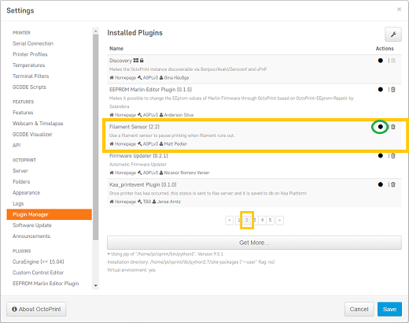
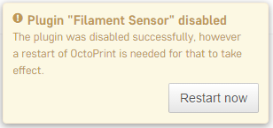

.. Sphinx RTD theme demo documentation master file, created by
   sphinx-quickstart on Sun Nov  3 11:56:36 2013.
   You can adapt this file completely to your liking, but it should at least
   contain the root `toctree` directive.

=================================================
Troubleshooting
=================================================

---------------
Print Not Sticking to Bed
---------------

If you are experiencing problems with the plastic not adhering to your print bed, there are a few things that can be done;

1. **Update**
  * Make sure to update your printer to the latest version of RoboOS. This will ensure that you have the latest version of the firmware that is flashed to your controller board, and have the most up-to-date and tested version of build plate leveling.
2. **Re-run the z-offset wizard**
  * Re-running the z-offset wizard will make sure that your bed is properly leveled. To do this, on the menu screen go to Utilities> Wizards>Z-offset Wizard.
3. **Replace the build plate adhesion**
  * After some time, the build plate adhesion can become unsticky and plastic will no longer be able to stick to it. Replace this with the black tape that came with your printer or order more from our store at www.robo3d.com. Unpeel the used build tape from the build plate, and replace with a new, fresh piece. Remember to re-calibrate your offset by selecting the z-offset wizard from the utilities menu.

.. image:: Images/Applying-bed-tape.gif
   :alt: Applying Bed Tape
   :align: center

4. **Using a raft**
  * Make sure to use a raft on all of your parts when preparing your print. This will allow a bigger surface area of plastic to stick to the bed, and can compensate for a small amount of unlevel bed.

5. **Lower fan speed**
  * If your prints are still curling after the above solutions are attempted, you can try lowering your fan speed to stop the plastic from cooling too fast and shrinking, causing warping. To do this go into your desktop software Cura for Robo. Under the settings> speed> fan speed and turn this setting down to 30%.

6. **First Layer Height and Width**
  * Set your first layer height to 0.3mm. This will allow more plastic to flow out of your nozzle, allowing a better adhesion to your print bed. You can also try making your first layer width of plastic higher. Usually a first layer width of 1mm is optimal - this will extrude more plastic at a lower layer height to allow more surface area of plastic bind to the print bed.

---------------
Grinding Noise when Starting a Print
---------------

If you are experiencing a grinding noise when trying to start a print, or when your printer is homing, there are some things to take a look at to make sure your printer hardware is in the right place. Sometimes during shipping or traveling, some things can come loose, so lets check those.

1. **Rods are out of place**
 * Make sure your rods are in the correct position. While moving to the home position, these rods will hit switches to let the printer know it is in the 0 position. If these rods have been moved out of the way, they will not hit the switch, and the printer will try and continue to travel past its 0 position, resulting in a grinding noise. The picture below will show you how they will look out of place, and also how they should look to work correctly.

.. image:: Images/rod-out.png
   :alt: Rod Out
   :align: center

.. image:: Images/rod-in.png
   :alt: Rod In
   :align: center

* To correct these, hold the plastic bracket the end of the rod is being held by with one hand. With your other hand, grab the rod that is furthest to the back left of the printer and slowly slide it into place (left on the x axis, away from you (back) on the y axis).

.. image:: Images/adjusting-rod.gif
   :alt: Adjusting Rod
   :align: center

* Note: Make sure that the rod is not directly touching the side wall of the printer when placing back into its position. Once you have slid the rod over to the edge of the wall, back it off just slightly so it is not rubbing the side wall when moving back and forth.

---------------
Material Not Extruding
---------------

1. **Nozzle isn't heating up**
 * Make sure all of your wiring is plugged in and firmly mounted in its correct brackets.
 * Nozzle Wires should be plugged into the correct terminals on the underside of the extruder.

* Wires should be plugged in and seated correctly on the top electronics board at the top of the extruder. Remove the extruder cover then check the wires.

.. image:: Images/Extruder-cover-off.gif
   :alt: Extruder Cover Off
   :align: center

2. **Drive Gear is not cleaned**
 * Turn Off the Printer
 * Take off the extruder cover
 * Use a toothbrush to clean this drive gear of debris shown in the picture
 * Turn the shaft, and continue scrubbing until it is cleaned of debris

.. image:: Images/Drive-gearscrub.png
   :alt: Drive Gear Clean
   :align: center

3. **Material is stuck around the spool**
  * Every so often, the material can get stuck on the spool holder or in the spool itself
  * If the material is tangled on the spool holder, unwind about 12 inches or 25 cm of filament to loosen it, then reel it back around the spool neatly, trying not to cross over plastic as it spools onto itself
  * If the material is tangled within the spool, you will need to unwind some the spool and see where it is crossing over itself. Cut the plastic where you find it is crossing over itself, and feed it back into the machine.

4. **Drive Gear is not tightened down**
 * If your motor shaft is turning, but the drive gear is not, it means you need to tighten down your drive gear.
 * To do this, turn off your machine and remove the extruder cover.

.. image:: Images/Extruder-cover-off.gif
   :alt: Extruder Cover Off
   :align: center

* Next, unscrew the extruder tensioner cover with a screwdriver.

* Take the allen wrench that came in your tool kit, and unscrew the bolt connecting the extruder tensioner to the extruder.

* Once that is off, go ahead and use the smaller allen wrench to screw the drive gear set screw tight. Make sure it is seated all the way up to the spacer.

.. image:: Images/Drive-gear-tightening.png
   :alt: Extruder Cover Off
   :align: center

* Now reverse these steps to put it all back together

---------------
Shifting Layers/bad print quality
---------------

1. **Loose Pulleys**
 * If the pulleys on the X and Y axis come loose, you may need to tighten down the set screws to hold these in place.
 * Move the Extruder into the center of the printer, and find the set screws on the pulleys in the corners of the axis. There are a total of 10 pulleys that you must check (2-3 in each corner), and each has 2 set screws to make sure to tighten down.

2. **Unaligned Axis**
  * Re-align your axis to be perpendicular to each other. To do this, use the orange clips that came with your printer.
  * Unplug your machine, and move your extruder to the front right corner.
  * Using the orange rod stabilizers, attach one at each corner of the gantry, completing a square. This should re-align your brackets and revive your print quality.

---------------
Hotend Clogged
---------------

1. **Not Heating up enough**
 * Make sure all of your wiring is plugged in and firmly mounted in its correct brackets.
 * Nozzle Wires should be plugged into the correct terminals on the underside of the extruder.
 * Wires should be plugged in and seated correctly on the top electronics board at the top of the extruder.

2. **Material stuck below the Drive Gear**
 * If your motor shaft is turning, but the drive gear is not, it means you need to tighten down your drive gear.
 * To do this, turn off your machine and remove the extruder cover.

.. image:: Images/Extruder-cover-off.gif
   :alt: Extruder Cover Off
   :align: center

* Next, unscrew the extruder tensioner cover with a screwdriver.

* Take the allen wrench that came in your tool kit, and unscrew the bolt connecting the extruder tensioner to the extruder.

* Once that is off, go ahead and use the smaller allen wrench to unscrew the drive gear set screw loose.

.. image:: Images/Drive-gear-tightening.png
   :alt: Extruder Cover Off
   :align: center

* From here, you can use the tweezers that came in your tool box to grab onto the filament that is stuck. Be sure to heat up the hotend before trying to pull out the filament.

3. **Hotend fan is not on**
  * If your hotend fan is not on (the third fan on the back of the extruder), then it is most likely your hotend isnt being cooled enough and will jam your nozzle. The fan is most likely unplugged.
  * Take the red and black fan wires, and look for the terminal plug that is empty on the back underside of the extruder.

---------------
Hotend Falling Out
---------------

If you are experiencing your hotend falling out from the extruder, there is a simple fix that will lock your extruder in place

1. **The tension screw is not tight enough**
 * The allen screw located on the front aluminum plate is the tensioner that holds your hotend in place. It is likely that this has come loose. Grab the allen wrench out of the tool kit that came with your printer.
 * Make sure to turn off your printer.
 * Loosen your hotend by turning the tensioner screw counterclockwise a few turns.

.. image:: Images/Hotend-tensioner-loosen.gif
   :alt: Loosening Hotend
   :align: center

* Push the hotend as far as it can go up into the seated ring and make sure it is flat against it.
* While you are holding it there, screw the allen screw clockwise until you feel a good amount of resistance and the hotend cannot be pulled out with your hand. Make sure you align the heater block to be parallel with the fron of the extruder so the hotend cover will lay flat against the magnets when reinstalling.

.. image:: Images/Tightening-hotend-tensioner.gif
   :alt: Tightening Hotend
   :align: center

* Turn the printer back on and test. If it still falls out, try tightening the allen screw even more.

---------------
Drive Gear aligning and tightening
---------------

If your drive gear has come loose and/or it is not aligned with the filament to hotend pathway, take these steps to realign and retighten:

Note: Make sure there is no filament loaded into the extruder. If there is, heat up your extruder and remove any filament.

1. Remove your extruder cover.

.. image:: Images/Extruder-cover-off.gif
   :alt: Extruder Cover Off
   :align: center

2. Turn the extruder motor shaft so that the flat surface of the shaft is pointing at 10 o'clock (see picture below).

.. image:: Images/10oclock.png
   :alt: 10 oclock
   :align: center

3. Use your allen wrench to loosen the set screw on the drive gear so that it is able to freely spin on the motor shaft.

.. image:: Images/tighten-drive-gear.png
   :alt: loosen drive gear
   :align: center

4. Now we are going to align and tighten your drive gear. Grab a small length of filament to help you through this.

5. Apply pressure to the filament lever arm and insert the filament through the filament feed hole.

6. Push and pull the filament, while making sure it is centered with the drive gears grooves, until the drive gear is in position (it will self align when the filament starts passing through it).

.. image:: Images/gear-alignment.gif
   :alt: Gear Alignment
   :align: center

7. Align the set screw with the flat surface of the motor shaft. Visually check to make sure the groove on the drive gear is aligned with the hole going down to the hotend.

8. Tighten the set screw on the flat surface of the motor shaft.

9. Replace your extruder cover and you are all set.

---------------
Screens Goes White or Doesn't Work
---------------

If the screen is not working there is a few steps that need to be taken to solve the issue.

1. **Loose Wiring**
 * First, remove the black bezel (which is the black plastic holding the screen) by gently pulling inward from the inside edge of the plastic. From here you will be able to see the electronics of the printer.

.. image:: Images/Bezel-removal.gif
   :alt: Bezel Removal
   :align: center

* Next, raise your bed by manually turning the long threaded z screw until the bed is mostly all the way up. Now remove the internal lid under the bed that says Robo on it for better access to the electronics.

.. image:: Images/Z-Screw-Raise.gif
   :alt: Raising Z Screw
   :align: center

.. image:: Images/Inside-Cover-Removal.gif
   :alt: Inside Cover Removal
   :align: center

* Here, you will see a ribbon cable attached that attaches the screen to a green electronics board. On the screen side, detach the screen cable and re-attach. Do the same thing for the green electronics board side.

.. image:: Images/Screen-Plug.gif
   :alt: Screen Plug
   :align: center

.. image:: Images/Pi-Ribbon-Cable.gif
   :alt: Pi Screen Plug
   :align: center

* Next, find the micro usb cord that is plugged into the bottom right corner of the green electronics board. Unplug this and plug it back in.

.. image:: Images/Pi-Power-Cable.gif
   :alt: Pi Power
   :align: center

* Finally, follow the micro usb cord you just unplugged and follow it to the other end on the black board. It should be plugged in on the black electronics board in a terminal labeled 5V right next to Fan2 plug in. Unplug and re-plug this back in.

2. **If your screen is still broken**
  * Contact customer support at www.robo3d.com/support

---------------
Hotend Cover is falling off
---------------

If your hotend cover is falling off when printing, or is teetering side to side and not flat against the extruder, more that likely your hotend is blocking it. To fix this, follow these steps:

1. Remove your hotend cover.

2. Loosen the hotend tensioner screw slightly. You do not need to loosen it completely, only enough to be able to rotate the hotend while it is still inside its mount.

.. image:: Images/Hotend-tensioner-loosen.gif
   :alt: Loosening Hotend
   :align: center

3. Align the heater block to be parallel with the extruder carriage. Make sure the heater block is not turned in such a way that it is sticking out past the extruder carriage.

4. Tighten the hotend tensioner screw. Remember to not overtighten this screen, as it may be hard to perform maintenance later.

5. Replace the hotend cover

---------------
Filament Runout Sensor Error
---------------

If you see an error while printing that

1. **Make sure you are not bypassing the filament block**

* In order for the filament sensor to work correctly, the filament needs to be run through the filament block on the backside of your printer. The filament sensor is located in this black block and will give an error of no filament if the filament is being run on the outside. Make sure you run all filament through this block to ensure the filament sensor will detect your material.

2. **Disable the filament runout sensor**

* If the filament runout sensor is still reading that there is no filament inside your printer, even though it is going through the filament sensor block, you can disable this software setting via the web browser. Take these steps to disable the filament sensor:

1. Connect your printer to Wi-Fi. Go to Utilities> Network> Configure Wi-Fi and connect your printer.

2. Once you are successfully connected to the internet, lets find your IP address. Go to Utilities> Network> Network Status. Here you will find the IP address.

3. Next, open up your browser (such as Google Chrome, or Mozilla Firefox), and enter that same IP address into the address bar. You should see a dashboard come up that looks like this:

4. Click on the 'Settings' button in the top right of the interface.

5. A settings window will pop up. On the left hand side, scroll down and select the item labeled 'Plugin Manager' under 'Octoprint' about half way down the list.

6. You will now see a list of plugins that are installed onto your printer. From here click the next page over until you see the line item labeled 'Filament Sensor'. Click on the small black button to the right of the item (circled in green in the picture below).

7. Once you have de-selected this plugin, you will need to restart Octoprint. A pop up will show on the top right of the interface - click 'restart now'. You should be good to print without filament runout detection interruption.

---------------
Firmware Update
---------------

This will walk you through the steps to update your firmware from the touchscreen and a USB drive.

1. Make sure you have the latest firmware. Download here: C2_Firmware_.

.. _C2_Firmware: https://robo3d.com/wp-content/uploads/2017/06/Marlin.C2.1.1.7.hex_.zip

2. Unzip the file and place the file onto a USB drive.
3. Place the USB drive into the USB slot on the front of your Robo C2.
4. On the touchscreen, navigate to Utilities > Options > Firmware Update

.. image:: Images/options-screen.png
   :alt: Options Screen
   :align: center

5. The next screen will show the .hex firmware file from your USB drive that you put on in step 2.

.. image:: Images/firmware-screen.png
   :alt: Firmware Select
   :align: center

6. Click on the file name, and click 'Start' to start your firmware update.

.. image:: Images/confirm-hex-file.png
   :alt: Confirm Hex File
   :align: center

7. Wait a few minutes for the firmware to be loaded onto your Robo C2, and it will automatically reconnect.

.. image:: Images/firmware-is-updating.png
   :alt: Firmware is Updating
   :align: center

8. Your Robo C2 should now have the latest firmware updated.

---------------
Error Messages
---------------

If you are receiving error messages on your Robo C2, the following instructions will give you information about them, and also show you how to fix them and get you back up and running in no time.

Connection Interrupted
---------------

This connection interrupted error is a result of the main electronics board not being detected. There are a few ways this can happen - more discussed below.

1. First step in resolving this error is trying to reset the connection to the printer. A button is displayed within the error message labeled 'Reset'. Press that to initiate an electronics reset. If this doesn't work, look to the next step to try and resolve the problem.

2. Check your wiring on the top of your extruder. Make sure the two ribbon cables on the top of extruder are locked into place. Also, make sure the other white plugs are seated into their sockets all the way.

3. Check the wiring on your hotend. Sometimes these can come loose and send an error to the electronics. There will be two sets of wires. One for the temperature reading, and one for the heating power. Make sure these plugs are seated all the way up into their sockets. The wires should be seated all the way to the left. The thinner wires are the ones that go toward the front of the extruder, and the thicker, all red wires should be plugged into the plug towards the back of the extruder.

.. image:: Images/hotend-wires.jpg
   :alt: Hotend Electronics
   :align: center

4. Check the wiring on your main electronics board. Every so often, the ribbon cable coming from the main electronics board can come loose. You will need to first take the inner panel out, located inside the printer below the bed, to get to the inside of the printer. Once that is out, you will see two electronics boards. We want to look at the one on the left, which is black. On the back right of the black electronics board, there is a ribbon cable plugged in. Make sure this ribbon cable is seated all the way down into its plug to ensure there is a proper connection.

.. image:: Images/electronics-ribbon.jpg
   :alt: Electronics ribbon
   :align: center
