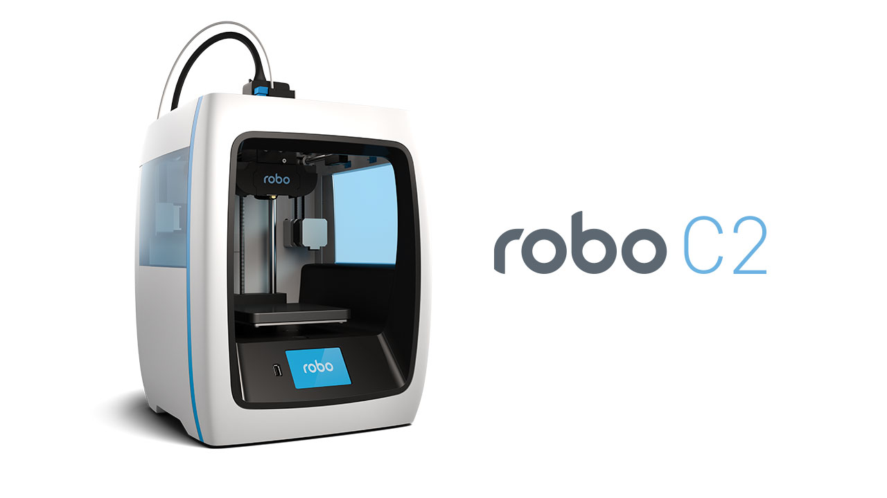

.. Sphinx RTD theme demo documentation master file, created by
   sphinx-quickstart on Sun Nov  3 11:56:36 2013.
   You can adapt this file completely to your liking, but it should at least
   contain the root `toctree` directive.

======
Robo C2 Installation and User Manual
======

.. toctree::
   :maxdepth: 2
   safety/index.rst
   getting-started/index.rst
   operation/index.rst
   maintenance/index.rst
   Troubleshooting/index.rst

Robo™ C2 User Manual
by Robo 3D, Inc.
Copyright © 2017 Robo 3D, Inc.
Permission is granted to copy, distribute and/or modify this document
under the terms of the Creative Commons Attribution 4.0 International
Public License (CC BY-SA 4.0).
Published by Robo 3D, Inc., 5070 Santa Fe Street Suite C, San Diego, California,
92109 USA.
