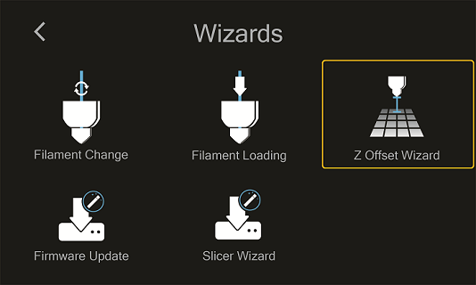
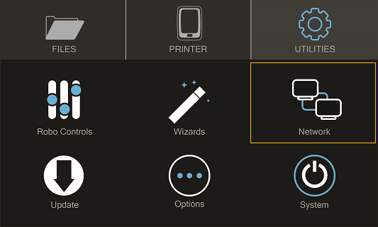
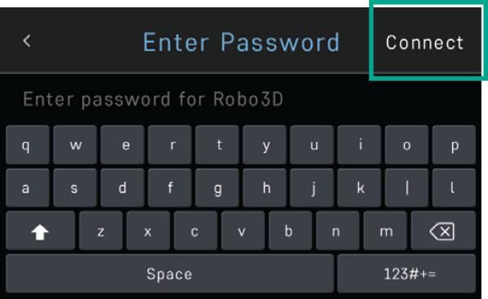

.. Sphinx RTD theme demo documentation master file, created by
   sphinx-quickstart on Sun Nov  3 11:56:36 2013.
   You can adapt this file completely to your liking, but it should at least
   contain the root `toctree` directive.

=================================================
Operation
=================================================

-----------
Display Screen
-----------

The color touch screen display on the front of your Robo C2 is the main access point for setting up, controlling, and reviewing all components of your 3d printer. You can navigate through the menus by touch or a stylus.

Files
   -Here you are able to navigate through your files, whether they are on a usb thumb drive or on the local hard drive internally.

Printer
   -The print screen is the default screen when printing. This will show you file printing, extruder tempersture, a progress indicator, and pause and cancel buttons while in use.

Utilities
   -The Utilities menu offers a variety of options including: motor control, temperature control, z-offset wizard, network settings, and a way to update your printer

-----------
Setting the Z offset
-----------

Here we will calibrate Robo C2 by setting the Z-Offset and making sure your first layer is applied correctly

From the home screen select "Utilities"

Then select "Wizards"

.. image:: images/SelectWizards.png
   :alt: Select Wizards
   :align: center

Next select "Z-Offset Wizard"

Your printer will now home itself and get in position to set your offset

Follow the directions on the screen by taking a piece of paper or something similar that is the same thickness as a piece of paper. Press on the 'Up' arrow to raise the bed up toward the nozzle of the printer. Slide the piece of paper in between the nozzle and bed and continue pressing the 'Up" button until you feel resistance on the paper  between the Nozzle and the print bed. Note: You still want to be able to slide the piece of paper back and forth but with enough resistance that it is touching both the bed and the nozzle

.. image:: images/z-offset-move.gif
   :alt: Z offset move
   :align: center

Select 'Finished". Your printer will calculate your Z-Offset and then press 'Finished' to complete setting your Z-Offset.

-----------
Loading and Unloading Filament
-----------
Loading Filament

From the home screen select 'Utilities'

Next, select 'Wizards'

.. image:: images/SelectWizards.png
   :alt: Select Wizards
   :align: center

Select 'Filament Loading Wizard'

After you printer heats up, ensure you've cut the tip of the filament. Place the filament inside the feed hole, and press 'Next'.

.. image:: images/Filament-into-extruder.gif
   :alt: Loading Filament
   :align: center

The feeder gear will push your filament down, through the extruder, and out of the nozzle

.. image:: images/Filament-coming-from-nozzle.gif
   :alt: Filament Extruding
   :align: center

Once you see filament coming out of the bottom of the nozzle, select 'Next' and 'Finished'

Unloading Filament
  1. From the home screen select 'Utilities'
  2. Next, select 'Wizards'
  3. Select 'Filament Change Wizard'
  4. After you printer heats up, the feeder gear will start to retract the filament from the nozzle
  5. Once you see filament coming out of the top of the extuder, select 'Next' and 'Finished'

-----------
Start a print
-----------

Starting a print from your internal storage

Select 'Files' from the home screen

Select a file you would like to print

.. image:: images/Selectafile.png
   :alt: Select a file
   :align: center

Now select 'Start' to print - and be sure to wait several second while the Robo C2 prepares to print the file

Note; you can select 'Pause' to pause your print, or you can select 'Cancel' to cancel your print

Note; you can change the nozzle temperature by pressing on the extruder and adding in your desired temperture

Starting a print from a USB flash drive
   1. Insert the USB flash drive into the usb slot on the front of the printer
   2. Select 'Files' from the home screen
   3. Select which file you would like to print
   4. Next, you can choose whether or not you would like to download the file directly to the printer or print directly from the usb
   5. Finally, select 'Start' to start the print

-----------
Print Status
-----------

There are three ways to check on the status of your print while your Robo C2 is at work printing away

Screen
   * While your Robo C2 is printing, you can simply check the status by selecting 'Printer' on the home screen. This will indicate the name of the file printing, what percentage done your print is, along with the nozzle temperature

Robo App
   * If you have the Robo App, you can check on the status of your print by selecting the printer under the 'Dashboard' tab This will indicate the name of the file printing, what percentage done your print is, along with the nozzle temperature

Web app
 * If you have a web browser on your computer or mobile device, you can check on the status of your print by navigating to its IP address in the navigation bar of the browser
 * To see the IP address of your printer, select 'Utilities' from the home screen

* Next select 'Network'

* Then select 'Network Status' and note the IP address of your Robo C2

* Copy that number into your browser navigation bar, and it will bring you to a web app to see all things with your Robo C2

-----------
Using print bed adhesion
-----------

The Robo C2 has a print bed adhesion tape already installed with your printer. These will usually last about 10-30 prints depending on the model you print on it.
   - In order to make sure you get good adhesion of your print, make sure to wipe the print bed adhesion with isopropyl alcohol before every print.
   - If your prints have a hard time sticking to the bed, you can replace the print bed adhesion with the extras that came in your inclusions box or buy directly from www.robo3d.com store

.. image:: images/Applying-bed-tape.gif
   :alt: Applying Bed Tape
   :align: center

------------
Removing the print
------------

   1. When the Print is completed, remove the print plate with the finished print on it from the C2 by lifting the bed up and away from the magnets.
   2. Slowly slide the print bed out of the machine and hold with two hands on opposite ends of the print plate.
   3. Now, flex the print plate back and forth to create a gap in between the print and the print plate. Move to the opposite corners and repeat twisting until the majority of the print has come loose.
   4. Carefully remove the print from the print plate with your hand.

.. image:: images/Removing-Print.gif
   :alt: Removing Print
   :align: center

.. note:: If the print is not coming loose after flexing the bed, use the provided spatula scraper carefully to skim the border of your print. Slowly work your way underneath the print toward the middle until your print comes loose. Do not try and pull the print from the plate directly up from the middle, as it may cause your print to break.

-----------
Setting Up Wifi
-----------
 * To begin connecting to your Wi-Fi network, Select 'Utilities' on home screen.

* Select 'Network'.

* Select 'Configure WIFI'.

.. image:: images/selectconfigurewifi.png
   :alt: Select Configure Wi-Fi on Home Screen
   :align: center

* Then select your Wi-Fi network and use the on-screen keyboard to enter your password.

.. image:: images/selectwifinetwork.png
   :alt: Select Wi-Fi Network
   :align: center

* Once you’re done, select CONNECT.

Your printer is capable of starting If no Wi-Fi signals are available for connection, you can use Hotspot Mode to emit a Wi-Fi signal from Robo C2 in order to connect to it wirelessly from your smart device. To access Hotspot Mode, do the following:

Hotspot Mode
   1. Select “Utilities” on the home screen of the Robo C2 touch screen
   2. Select “Network” from the list
   3. Select “Start Hotspot Mode” from the list
   4. Your Robo C2 is now casting it's own wireless network

-----------
Downloading the Robo App
-----------
From your iOS Device
   1. Open the App Store app
   2. On the bottom dock, tap on search
   3. Enter “Robo App”
   4. Tap on the Robo App
   5. Tap download on the right of the icon, and rate us 5 stars if you like it!

-----------
Connecting your iOS device to your Robo C2
-----------
Connecting via a local wifi network
   1. Make sure your smart device is connected to the same wifi network as your Robo C2
   2. In the ‘dashboard’ screen of the Robo App, tap ‘+Add a Printer’ in the middle of the screen
   3. Select ‘Scan for Printer Name/IP’
   4. A pop up will appear with all of the printers on the same network as your smart device, go ahead and select which printer you would like to add (your printer has a unique name, example - Curious Tesla, or Brilliant Einstein). (You may look on the back of your printer and find out which name your printer has been givin).
   5. Now you will need to scan the QR code on your screen to fully connect the 3d printer to your smart device.

		+ On the screen of your machine, select  ‘Utilities’
		+ Select ‘network’
		+ Select ‘QR Code’
   6. Tap on ‘Scan Printer Barcode for Key’
   7. Point your camera at the barcode and wait for the app to recognize the 3d printer
   8. Tap ‘add printer’ at the bottom of the screen
   9. Congratulations, you have now added your Robo C2 to your app
   10. note that you can add multiple machines to the same app, and control each one independently

Connecting via Hotspot Mode
   1. Make sure that you are connected to the wifi signal that the machine is emitting
   2. Follow steps in the previous section to successfully connect your printer to the app

-----------
Updating Your Printer
-----------
Make sure to update your printer to grab the benefits of all the latest Robo has to offer, as well as making sure your Robo C2 performs to the best of its ability.

 * Select "Utilities' from the main screen

* Select 'Update'

* Check to see if you have the most up-to-date software. If not, go ahead and update to get the best use from your Robo C2
