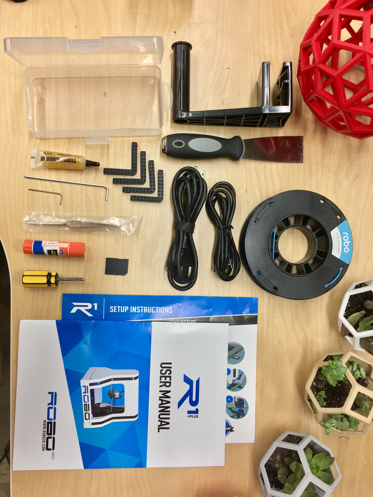
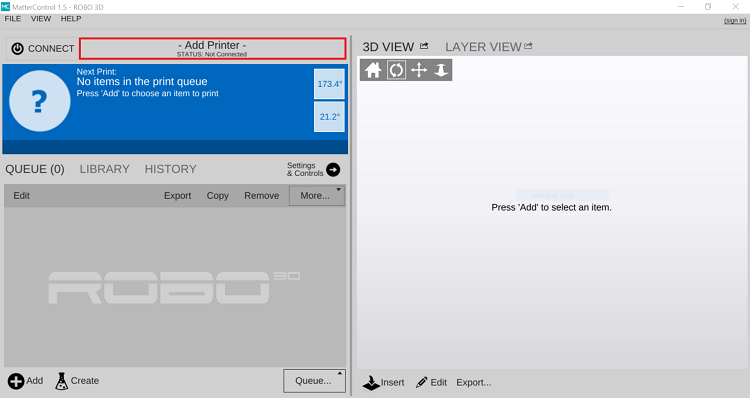
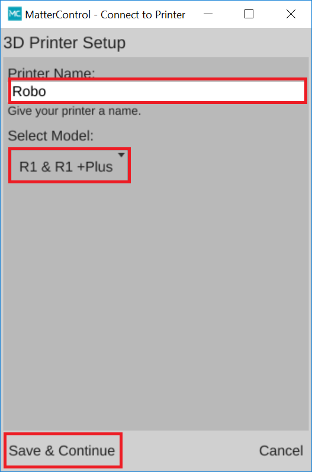
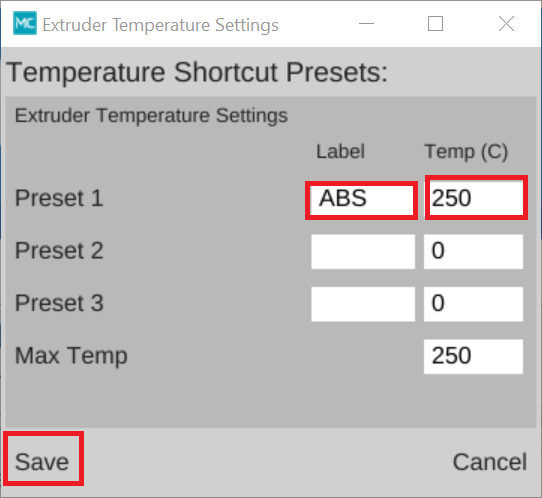
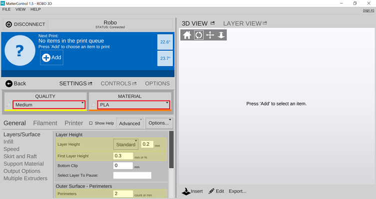
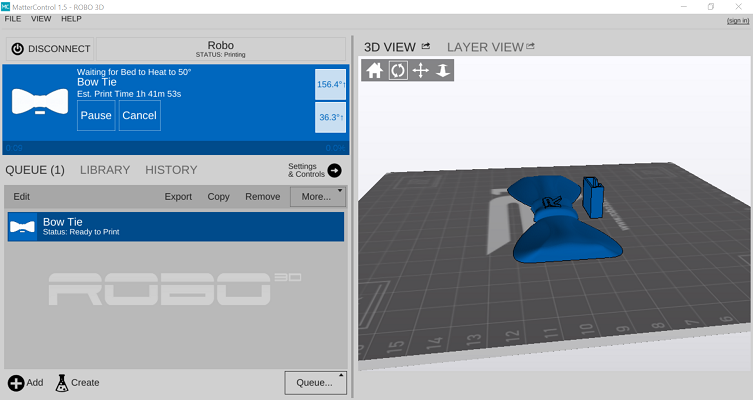

.. Sphinx RTD theme demo documentation master file, created by
   sphinx-quickstart on Sun Nov  3 11:56:36 2013.
   You can adapt this file completely to your liking, but it should at least
   contain the root `toctree` directive.

=================================================
Getting Started
=================================================

.. image:: images/r1-blank.jpg
   :alt: R1 Header
   :align: center

---------------
What’s in the box
---------------

Besides your new Robo R1+ Plus, you will find the following in the box:

1. Setup Instructions
2. Power Cable
3. USB Cable
4. Spool Holder
5. Toolbox with lubricant, screw driver, allen wrenches, tweezers, a glue stick, and rubber feet.
6. SD Card
7. 300g Robo light blue PLA filament
8. Spatula
9. User Manual

---------------
Register your Robo R1+ Plus
---------------
Before you start, please register your Robo R1+ Plus for any servicing or warranty needs if they’re ever required. You can register your product by visiting our registration_site_.

.. _registration_site: https://www.robo3d.com/register

---------------
Unboxing Robo R1+ Plus
---------------

Now that you've received your Robo R1+ Plus, it's time to unbox it and get familiar with your printer and accessories.

The printer's accessories are stored in the top foam piece of the printer. Remove these pieces from the top foam.

.. image:: images/door-ziptie-cut.gif**********
   :alt: Door Zip Tie
   :align: center

Your R1+ Plus is housed in 4 styrofoam pieces, one on top, one on bottom, and two from the sides. Simply lift the top foam piece off and set to the side. Now lift the printer out with two hands and set on your desktop.

.. image:: images/unclipping-box-R1+ Plus.gif*********
   :alt: Taking it out
   :align: center

Now we are ready to take out the inner packing material. There are 4 pieces of foam that we need to take out. Two on the sides of the printer, and two just below the glass build plate. Go ahead and slide those out.

.. image:: images/gantry-clips-off-R1+ Plus.gif*************
   :alt: Clip Removal
   :align: center

Finally, extend the ribbon cable from the back of the print bed so that it is no longer folded into the printer.

.. image:: images/blue-tape-out-R1+ Plus.gif*********
   :alt: Tape Out
   :align: center

.. tip:: Save your printer box and foam inserts for transportation. Also, you might need the original packaging to exercise your warranty or ship your printer in the future.

---------------
Initial set-up
---------------

Now let’s move forward with your initial set-up of Robo R1+ Plus.

Inside the toolbox, there are four small rubber feet; these attach to the corners of your printer to make sure it doesn't slide around your desk when printing. Place one on each corner.

.. image:: images/rfeet.gif
   :alt: Rubber Feet
   :align: center

From here, we will want to make sure our voltage is set correctly. On the back of the printer, there is a voltage switch that has two settings: 110 or 220V depending on which country you are using the R1+ Plus. Make sure it is compatible with your country code. You can use the end of one of the included allen wrenches to slide the switch.

.. image:: images/vswitch.gif
   :alt: Volts
   :align: center

From here you’ll want to connect the power cord to the designated area on the back of the printer and then plug it into an AC outlet. Now go ahead and turn on the printer.

---------------
Installing the required software
---------------

The Robo R1+ Plus comes with an SD Card. On this is the software required to run the Robo R1+ Plus. Take these steps to install and connect your printer.

1. Plug SD Card into your computer.
2. Click on the Windows or Mac folder depending on which operating system you have.
3. Choose MatterControl setup to begin installing MatterControl Software on your computer.

.. note:: You can also navigate to our  .. _Website: https://robo3d.com/software/ to download MatterControl.

---------------
Connecting Robo R1+ Plus to MatterControl
---------------

Here we will add your printer to the software which will enable you to control your printer.

Open up MatterControl that you installed from the previous section. Connect your printer to the computer USB port via the USB cord that came with your printer.

.. image:: images/USB.gif
   :alt: Connecting USB
   :align: center

After MatterControl opens, click the 'Add Printer' button at the top of the screen.

A new window will pop up and you will be able to set up a 3D printer. From here you can assign your Robo R1+ Plus a nickname. This helps you keep track of multiple units. Select “R1+ Plus” from the model list and then click Save & Continue.

Now a new set of windows will open and prompt to “Install Communication Driver”. Do this by clicking “Install Driver” in the bottom left corner of this screen. Once the driver is finished installing a “3D Printer Setup” window will appear. Follow the instructions on this screen. First disconnect your computer (if currently connected), by unplugging the USB connection then press continue. Then connect reconnect your printer when it prompts you(turn it on if it is off). Once the printer connects, you will see a “Connection Succeeded!” message. From here click “Done”.

.. image:: images/connect.png
   :alt: connect
   :align: center

Now you have successfully connected your R1+!
---------------
Loading filament
---------------

Before you begin a print you need to load filament. Follow these steps to properly load your printer with filament.

Take the spool holder that came with your printer and put it on by simply sliding it onto one of the arms of the top plastic.

.. image:: images/spoolholder1.gif
   :alt: Unhinge Spool Holder
   :align: center

To begin loading filament you need to preheat your nozzle through MatterControl. On the Main Dashboard, click Settings & Control

.. image:: images/settings.png
   :alt: Settings
   :align: center

You can either click the PREHEAT button to preheat the print to a default temperature of 210C. Or create your own presets by clicking the pencil next to Extruder Temperature.

.. image:: images/preset.png
   :alt: preset
   :align: center

If you choose to create your own preset, a new Window will popup after clicking the pencil. In this window you can set up to 3 custom presets. Once you name the preset and designate a temperature press Save.

After you click PREHEAT or one of your own presets, you should notice the target temperature to change to your desired temperature.
.. note:: You can preheat and create presets for the bed as well but it's not necessary to load filament.

.. image:: images/preheats1.png
   :alt: preheat
   :align: center

While that is heating up, hang your filament spool on the spool holder.

.. image:: images/filplace.gif
   :alt: Place spool on holder
   :align: center

Be sure to unroll at least 11”— or 30 centimeters — of filament and cut the tip with a pair of scissors.

.. image:: images/filcut.gif
   :alt: Cut Filament
   :align: center

Now thread the filament through the filament latch at the top of the printer

.. image:: images/filtop.gif
   :alt: Thread
   :align: center

.. image:: images/filthread.gif
   :alt: Thread
   :align: center

Insert filament through the filament gear, you may need to pull back the filament capture to thread the filament into the extruder.

 .. image:: images/filgrab.gif
    :alt: Thread2
    :align: center

Once inserted, turn the filament gear until you see filament coming out of the extruder nozzle.

.. image:: images/filgear.gif
  :alt: Turn
  :align: center

 Now you're ready to start printing!

 ---------------
The first print.
 ---------------

Now to start your first print. You can either load your own file, or choose one of the preloaded prints inside the local library. To print one of the preloaded files, navigate to the library tab and then select the Local Library.

.. image:: images/prints1.png
  :alt: library
  :align: center

Before you start a print, make sure to double check your slicing settings. To do that, under Settings & Control, select Settings. For most of the preloaded prints, default settings will suffice and all you need to do is make sure the Material you loaded the printer and desired print quality are correct. For more advanced prints and geometries, you may need to edit the slice settings to ensure a perfect print.

Once you select a file and finalize your settings press PRINT and your print will begin preheating. Your R1 will then begin printing as soon as the printer is completely preheated!

..note:: You can select PAUSE to pause your print, or you can select CANCEL to cancel your print.

---------------
Removing the first print
---------------

When the test print is complete and cooled down, use the provided spatula to carefully remove the print at its borders. Then, slowly work your way underneath the print until it’s loose. Don’t force the print loose by pulling it up directly up from the print bed, since this may cause your print to break.

.. image:: images/removing-print-R1+ Plus.gif*********
   :alt: Removing Print
   :align: center
