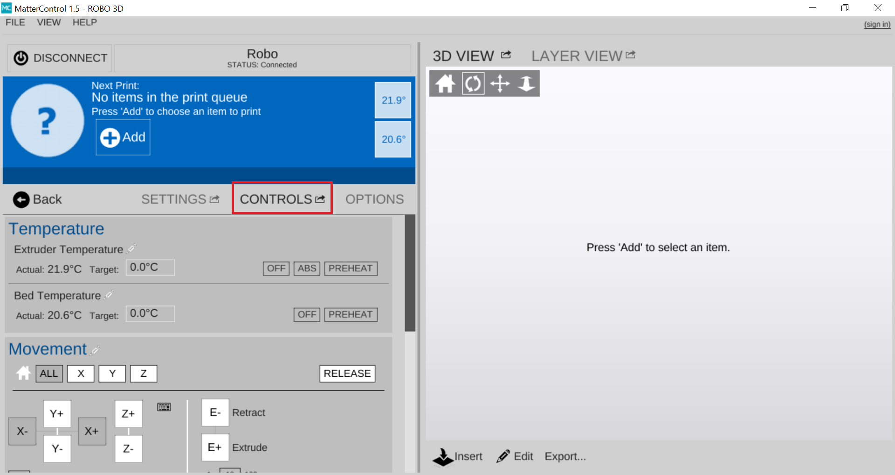
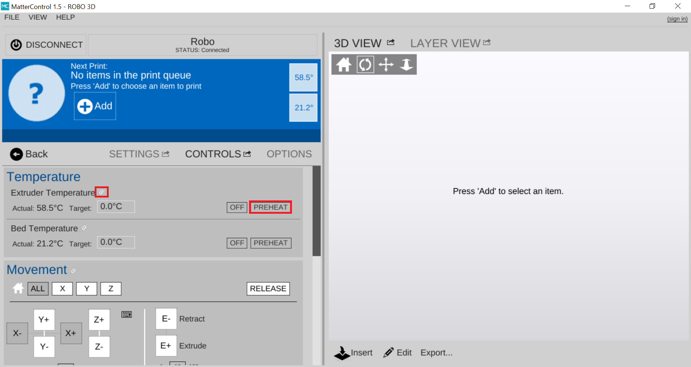
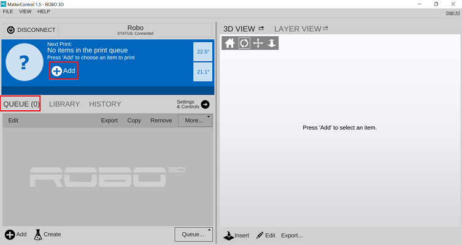
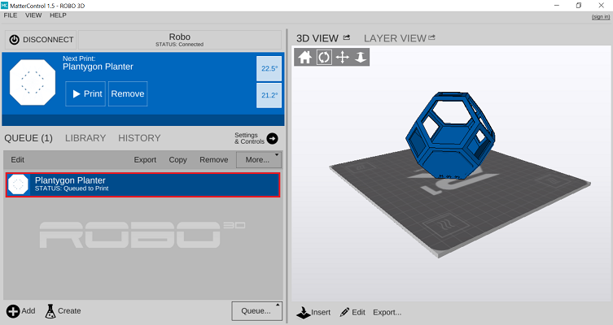
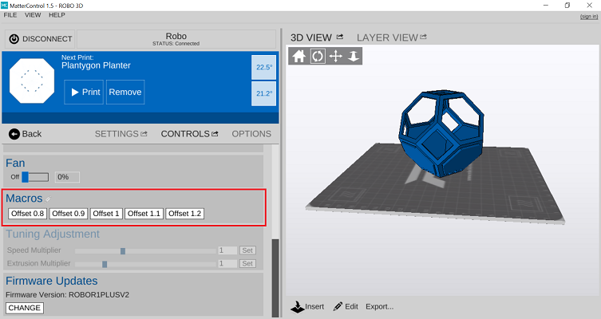

.. Sphinx RTD theme demo documentation master file, created by
   sphinx-quickstart on Sun Nov  3 11:56:36 2013.
   You can adapt this file completely to your liking, but it should at least
   contain the root `toctree` directive.

=================================================
Operation
=================================================

.. image:: images/r1-blank.jpg
   :alt: R1 Header
   :align: center

-----------
Controls
-----------

The “CONTROLS” tab is where you can physically control your printer through the software. Here you can pre heat your extruder and heated bed, and even adjust your print speed while printing.

Adjusting Temperatures
-----------

You can either click the PREHEAT button to preheat the print to a default temperature of 210C. Or create your own presets by clicking the pencil next to Extruder Temperature.

If you choose to create your own preset, a new Window will popup after clicking the pencil. In this window you can set up to 3 custom presets. Once you name the preset and designate a temperature press Save.

.. image:: images/presets1.png
   :alt: preset
   :align: center

After you click PREHEAT or one of your own presets, you should see the target temperature change to your desired temperature.

.. note:: You can also preheat and create presets for the bed as well.
.. image:: images/preheats1.PNG
   :alt: preheat
   :align: center

.. note:: An Extruder Preheat should be set between 230-250 for ABS filament or 190-210 for PLA filament. A Bed Preheat should be set between 80-100 for ABS and 50-70 for PLA filament

Movement Controls
-----------

You can use the movement controls on this panel (while your printer is idle) to move the X, Y and Z axis. The extrude/retract motor movement keys help in loading and unloading filament as well. You can unlock the motors after a print job in order to move them around by hand if need be. Also, if you need to home any or all of your axes you can do it here.

Speed and Extrusion Control
-----------

If you need to adjust the speed at which your extruder is printing, under Tuning Adjustment us the  "Speed Multiplier" slider at the bottom of the screen. If you want to adjust the rate at which your printer is extruding filament use the "Extrusion Multiplying". Drag it left to slow it down and right to increase the speed or flow rate. (This will only work while printing)

-----------
Loading files on MatterControl
-----------

Open up MatterControl and connect to your printer. Within the 'Queue', select the 'Add' button on the bottom left corner.

Add your file to the queue. When it shows up in the queue, select the file that you uploaded by clicking on it. When it is selected it will show up in the preview panel.

-----------
Setting your Z-Offset
-----------

If the offset on your printer is somehow not calibrated correctly, it may be too low or too high. Z-offset measures the distance between “On” and “Off” in your Z endstops for auto leveling. There is sometimes a tolerance to this because of the way that the endstop parts are manufactured. R1+ Plus 3D printers come standard with a Z offset of 0.9

To adjust your z offset, under the Controls tab, scroll down and press one of the macro buttons within MatterControl. Pressing the Macro button will save the offset to that value and you will not need to press it again unless you want to change your z offset to a different value.

* Lower z offsets are 0.8 and 0.9.
* Higher z offsets are 1, 1.1 and 1.2.

Slice Settings
-----------

After preheating your extruder and heated bed, double check that your slice settings are correct. Select your Quality and Material presets from the dropdown menus in the 'Settings' tab on the left hand window. In the frame below, can switch between Basic, Standard, and Advanced slicing settings that will allow you to make a range of fine adjustments to how your print will be sliced.

-----------
Load Filament
-----------

Begin by sliding the spool holder onto your printer.

.. image:: images/filplace.gif
   :alt: Place spool on holder
   :align: center

Be sure to unroll at least 11”— or 30 centimeters — of filament and cut the tip with a pair of scissors.

.. image:: images/filcut.gif
   :alt: Cut Filament
   :align: center

Now thread the filament through the filament latch at the top of the printer

.. image:: images/filtop.gif
   :alt: Thread
   :align: center

.. image:: images/filthread.gif
   :alt: Thread
   :align: center

Insert filament through the filament gear, you may need to pull back the filament capture to thread the filament into the extruder.

 .. image:: images/filgrab.gif
    :alt: Thread2
    :align: center

Once inserted, turn the filament gear until you see filament coming out of the extruder nozzle.

.. image:: images/gear.gif
    :alt: gear turn
    :align: center

    Now you're ready to start printing!
    --------------

-----------
Check the build plate
-----------

Make sure that your part is oriented efficiently. To check this, click the preview window at the top of your screen.

If you made any changes to the orientation of your part, make sure to save them before starting your print.

-----------
Print Bed Adhesives
-----------

In order for the plastic to stick to the glass of the build plate, you must use an adhesive. You can use a couple of different techniques for prepping your build plate. Two of the most commons methods we use here at Robo are to use a Glue stick or Hair Spray.

Before applying either adhesive, move the heated bed all the way out.

Glue Stick (supplied with your tool kit).

Open the Glue stick and apply perpendicularly to the printing surface of the build plate. Make sure no bumps are left on the build plate.

.. image:: images/gluestick.PNG
   :alt: glue stick
   :align: center

Hairspray (AquaNet works very well)

When using hairspray you can either raise the extruder(Using the motor controls on MatterControl), or cover the extruder and rods with your arm as you spray. Try not spray any of the rods within the machine.

.. image:: images/hairspray.PNG
   :alt: hairspray
   :align: center

Run
-----------

Now just click the start button! You will notice that your part slices in the software right before the print starts and the printer runs an auto leveling measurement sequence. From here let the printer do the rest of the work and watch your part grow!

-----------
Removing the print
---------------

When the print is complete and cooled down, use the provided spatula to carefully remove the print at its borders. Then, slowly work your way underneath the print until it’s loose. Don’t force the print loose by pulling it up directly up from the print bed, since this may cause your print to break.

.. image:: images/removing-print-R1+ Plus.gif*********
   :alt: Removing Print
   :align: center
