.. Sphinx RTD theme demo documentation master file, created by
   sphinx-quickstart on Sun Nov  3 11:56:36 2013.
   You can adapt this file completely to your liking, but it should at least
   contain the root `toctree` directive.

=================================================
Assembly
=================================================

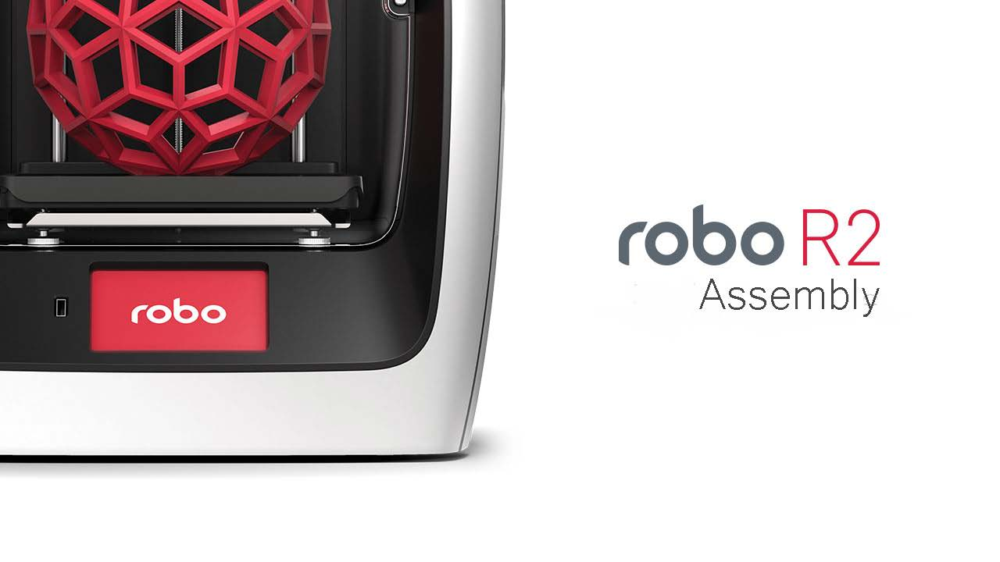

Get to know your Robo!

Here you will find assembly instructions incase you need to service your printer.

Gantry Removal
-----

**Step 1:** Unplug both X and Y Stepper Motors.

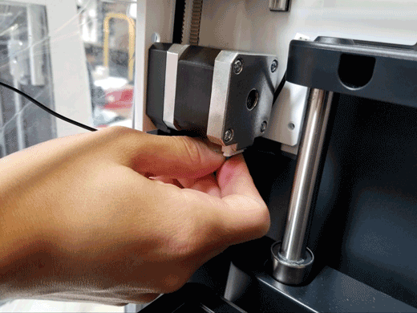

**Step 2:** Unplug both X and Y endstop switches.

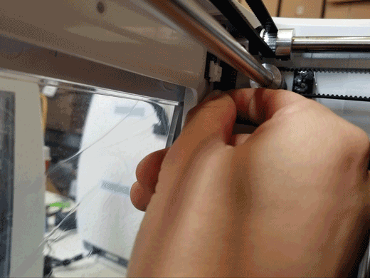

**Step 3:** Remove the extruder cover.

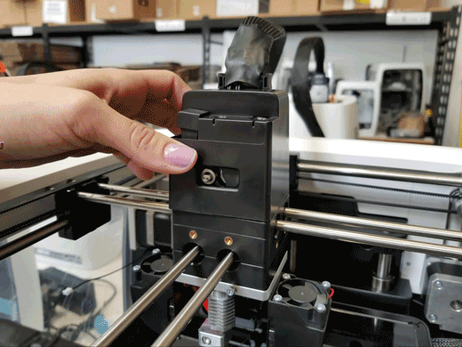

**Step 4:** Unlatch the extruder ribbon plug from its connector by pulling the latches outward. Unplug the two smaller connectors(pairs of black wires) and hang ribbon cable off the back of the printer, out of the way.

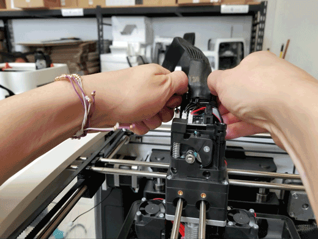

**Step 5:** Remove 2 screws on each motor mount, one screw near X motor, and one screw near Y motor.

.. note:: Be sure to keep track of which screws go where.

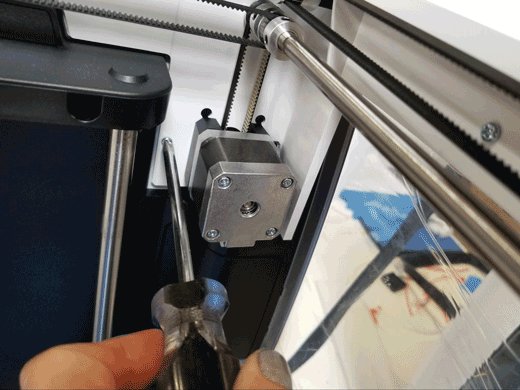

**Step 6:** Remove 8 screws which fasten the gantry assembly to the printer body. (2 screws for each side)

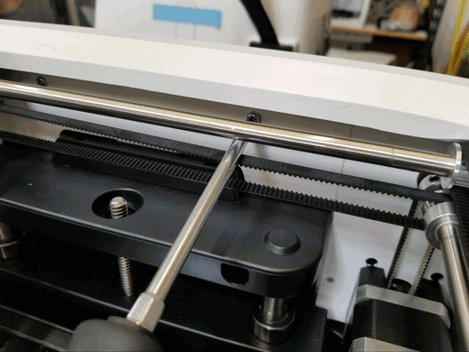

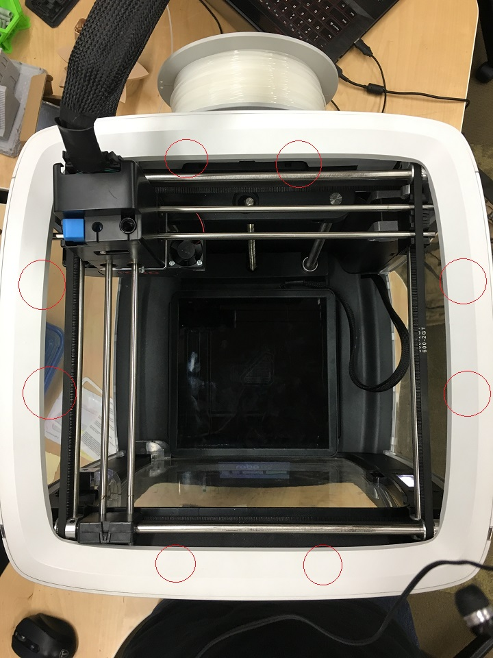

**Step 7:** Pull gantry assembly straight upward by grabbing the top cap from the inside on left and right sides.

.. image:: images/top-cap.gif
   :alt: Top Cap
   :align: center

**Reverse process in order to reassemble printer.**

**Step 8:** Carefully slide gantry back onto the top of the printer, being mindful that each tab slides into its respective slot.

**Step 9:** Re-fasten the two screws into the motor mounts near X and Y motors.

**Step 10:** Refasten the 8 screws which fasten the gantry assembly to the printer body. (2 screws per side)

**Step 11:** Re-insert the X and Y endstop plugs into their respective endstop connectors.

**Step 12:** Re-insert the X and Y motor plugs into their respective motor connectors.

**Step 13:** Power up your R2 and toggle the “home” function to ensure that each axis is working as expected.

Front Panel Removal
---------
**Step 1:** Please refer to the R2 Gantry Removal Guide. Follow all instructions to remove gantry before proceeding.

**Step 2:** Remove hatch cover and hatch from the inside of the printer (magnetic door stop can be removed for easier hatch removal). Move the bed manually to its uppermost position for better accessibility by twisting the lead screw clockwise (as seen below).

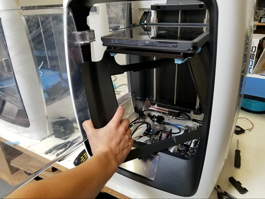

**Step 3:** Unplug USB cable from the top left USB port on the Raspberry Pi. Pull cable out of cable management clips along the bottom chassis.

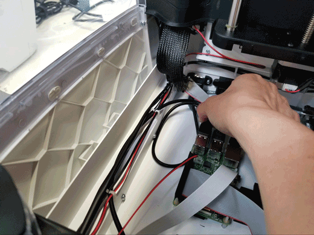

**Step 4:** Unplug HDMI cable from the Raspberry Pi.

.. image:: images/hdmi.gif
   :alt: hdmi
   :align: center

**Step 5:** Unplug LCD ribbon cable from the back of the LCD.

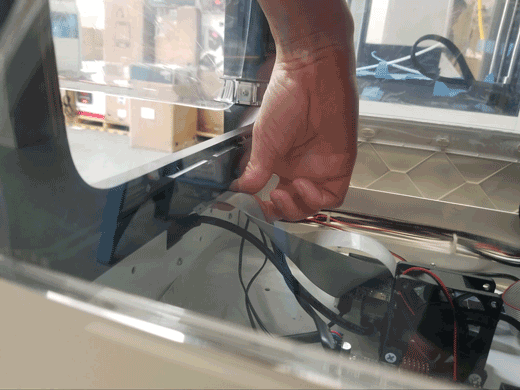

**Step 6:** Unplug LED connector(blue and white cable) from the Fan2 position of the mainboard. Pull cable out of cable management clips along the bottom chassis.

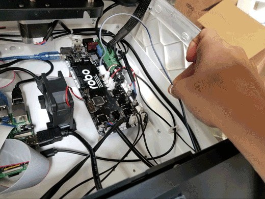

**Step 7:** Remove the camera ribbon cable from its connector. Pull upwards on the two black tabs to release the ribbon cable.

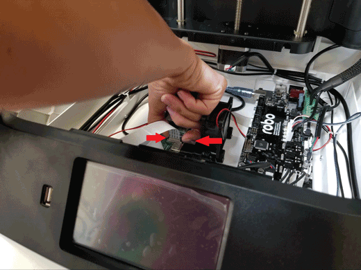

**Step 8:** Remove 7 screws that retain front panel to side panels and chassis. There are 2 top screws, 2 middle screws, and 3 bottom screws. Start with bottom, then middle, then top screws.

**Step 8.1:** 3 Bottom Screws

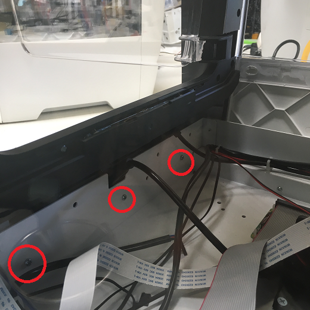

**Step 8.2:** 2 Middle Screws

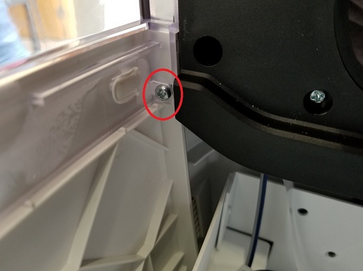

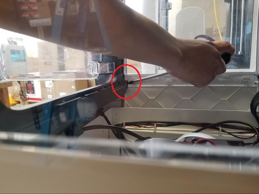

**Step 8.3:** 2 Top Screws

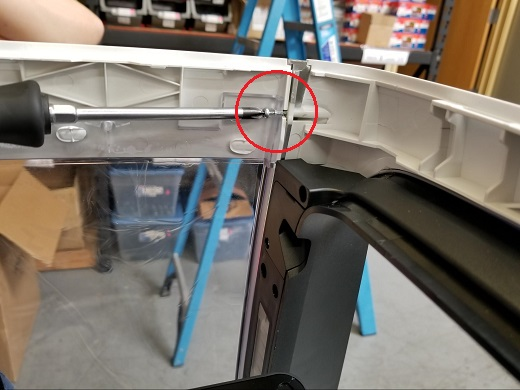

.. image:: images/top-2.jpg
   :alt: top 2
   :align: center

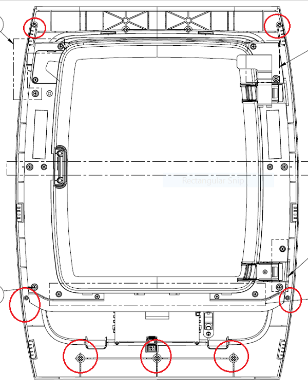

**Step 9:** Carefully pull front panel away from printer, being mindful of any wires that may snag in the chassis.

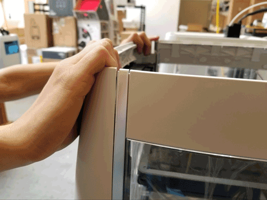

**Reverse process to re-install R2 front panel.**

LCD Screen Replacement
-----------

**Step 1:** Please refer to Robo 3D R2 Gantry Removal Guide and Robo 3D R2 Front Panel Removal Guide to remove both assemblies from your R2 printer to gain better accessibility to LCD screen. Please ensure that your R2 is powered off, and all pertinent cables/connectors have been disconnected.

**Step 2:** With gantry and front panel removed, **identify** the 11 screws you’ll need to unfasten in order to access the 4 screws retaining the LCD screen to the bezel.

**Step 3:** Identify the 5 outermost screws which fasten the bezel assembly to the front panel. Unfasten these 5 screws, making sure to remember where each screw goes.

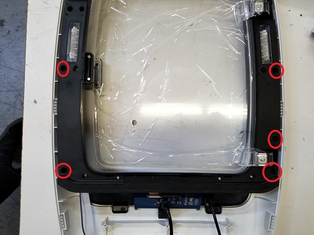

**Step 4:** Identify the 6 innermost screws which fasten the internal shroud to the bezel assembly. Unfasten these 6 screws (you do not need to remove the screws from their holes; backing them out is sufficient).

.. image:: images/six-screws.jpg
   :alt: next 6
   :align: center

**Step 5:** With one hand, bend the internal shroud up just enough to reveal the 2 uppermost screws that fasten the LCD screen to the bezel. Unfasten these 2 screws, release the internal shroud, then unfasten the lower 2 screws to remove the LCD screen.

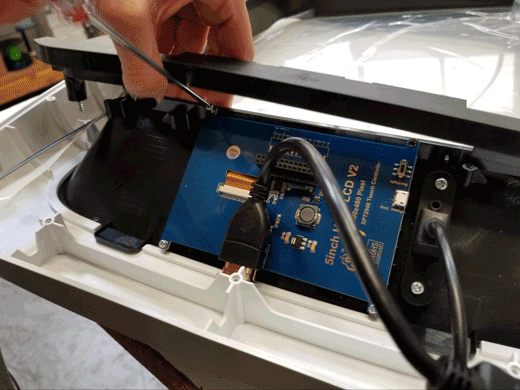

.. note:: You may find the LCD removal/installation process easier without the HDMI cable in the way. You may remove the cable for better accessibility. Please ensure to reconnect the cable properly by placing your finger underneath the HDMI adapter while pushing the cable back onto the adapter so that it does not unplug from the LCD screen.

.. image:: images/hdmi2.jpg
   :alt: HDMI Reconnection
   :align: center

**Reverse this process to re-install LCD screen.**
