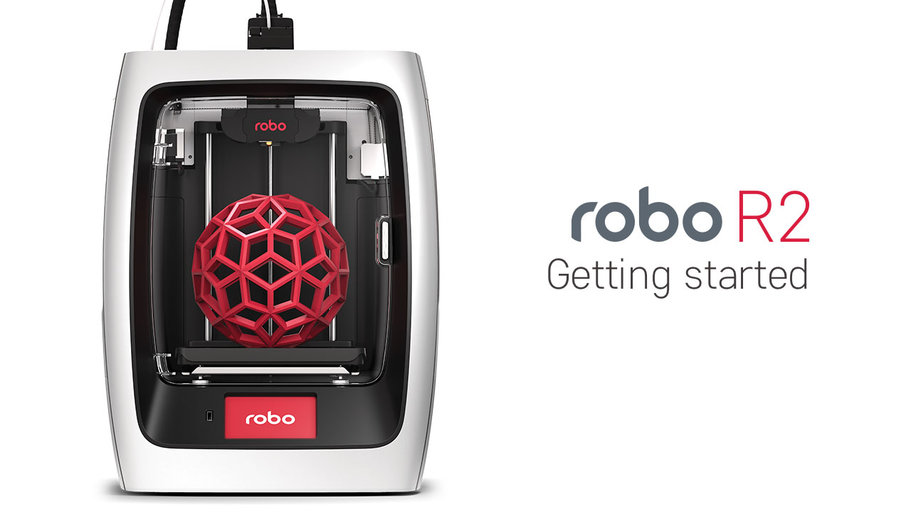
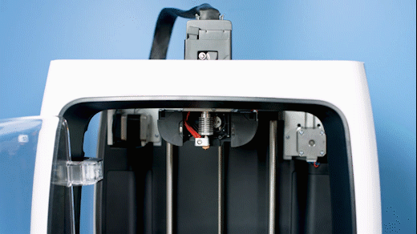
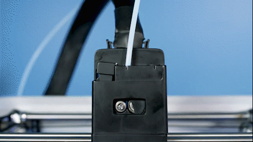

.. Sphinx RTD theme demo documentation master file, created by
   sphinx-quickstart on Sun Nov  3 11:56:36 2013.
   You can adapt this file completely to your liking, but it should at least
   contain the root `toctree` directive.

=================================================
Getting Started
=================================================

What’s in the box
---------------

Besides your new Robo R2, you will find the following in the box:

1. Quick Start Guide
2. Autodesk Fusion 360 design software free 1-year voucher
3. Robo stickers to place EVERYWHERE.
4. 24V power supply
5. Filament Guide Tube
6. Toolbox with the hotend cover, 2 allen wrenches, lubricant, and z-offset calibration card.
7. Robo USB drive
8. 300g Robo light blue filament
9. Spatula

.. image:: images/inclusions-box-r2.png
   :alt: Whats Inside the Box
   :align: center

Register your Robo R2
---------------
Before you start, please register your Robo R2 for any servicing or warranty needs if they’re ever required. You can register your product by visiting our registration_site_.

.. _registration_site: https://www.robo3d.com/register

Unboxing Robo R2
---------------

Now that you've received your Robo R2, it's time to unbox it and get familiar with your printer and accessories.

Your R2 is housed in 2 styrofoam pieces, secured together by a top and bottom box. Simply undo the 3 clips at the bottom of the box by pinching in and pulling, then slip the top box off.

.. image:: images/unclipping-box-r2.gif
   :alt: Taking it out
   :align: center

The printer's accessories are stored in the inclusions box inside the printer. First, you will need to take off the zip tie securing the door shut to access this inclusions box.

.. image:: images/door-ziptie-cut.gif
   :alt: Door Zip Tie
   :align: center

Now, undo the blue tape and simply slide the inclusion box out.

.. image:: images/inclusions-box-out-r2.gif
   :alt: Inclusions Box Out
   :align: center

Now we are ready to take out the inner packing material.

.. image:: images/packaging-out-r2.gif
   :alt: Packing out
   :align: center

There are 4 orange gantry rod holders that need to be taken off. There is one at each corner of the top gantry. Simply push on the clips with your thumb and they will come off.

.. image:: images/gantry-clips-off-r2.gif
   :alt: Clip Removal
   :align: center

Next, remove the zipties securing the rods to their plastic brackets.

.. image:: images/gantry-zipties-off-r2.gif
   :alt: Ziptie Removal
   :align: center

Now, remove the blue tape holding the moving parts stable.

.. image:: images/blue-tape-out-r2.gif
   :alt: Tape Out
   :align: center

Finally, using the handholds on the bottom of your R2, lift the printer out of the bottom styrofoam piece.

.. image:: images/r2-out-of-bottom.gif
   :alt: Take Out Of Box
   :align: center

.. tip:: Save your printer box, foam inserts, and inclusions box for transportation. Also, you might need the original packaging to exercise your warranty or ship your printer in the future.

Initial set-up
---------------

Now let’s move forward with your initial set-up of Robo R2.

Inside the inclusions box, there is a small toolbox; here you will find the hotend cover. Go ahead and take that out and place it over the hotend. It is held in with magnets so it just pops right in.

From here you’ll want to connect the power cord to the designated area on the back of the printer and then plug it into an AC outlet.

Now go ahead and turn on the printer.

It is necessary connecting Robo R2 to your Wi-Fi network. Doing so provides you with necessary updates that allows for a more enjoyable 3D printing experience.

.. note:: You can also use the provided Ethernet cable (LAN) to connect Robo R2 directly to your Wi-Fi network.

Wi-Fi Configuration
---------------

To begin connecting to your Wi-Fi network, Select UTILITIES on home screen. Select NETWORK. Select CONFIGURE WIFI. Then select your Wi-Fi network and use the on-screen keyboard to enter your password. Once you’re done, select CONNECT.

.. image:: images/connect-to-wifi-r2.gif
   :alt: Select Utilities on Home Screen
   :align: center

Updating
---------------

Now, you will need to update Robo R2.

Select UTILITIES. Then select UPDATE.

.. image:: images/update-software-r2.gif
   :alt: Update Screen
   :align: center

Update to the latest version and wait about a minute to get everything up-to-date. If your Robo R2 is already up to date, the button will be greyed out and say 'up to date'.

Calibration and setting Z offset
---------------

Next you’ll want to calibrate Robo R2 by selecting UTILITIES on the touch screen. Then select WIZARDS from the list. From here you’ll select Z OFFSET WIZARD. Now, the printer will wait to calibrate its home position.

.. image:: images/z-offset-wizard-r2.gif
   :alt: Bed to zero
   :align: center

.. image:: images/bed-to-zero-r2.gif
   :alt: Bed to zero
   :align: center

Follow the directions on the screen by using the calibration card or a standard sheet of paper. Press on the 'Up' arrow to raise the bed up toward the nozzle of the printer. Slide the calibration card in between the nozzle and bed and continue pressing the 'Up" button until you feel little resistance on the card between the Nozzle and the print bed. Note: You still want to be able to slide the calibration card back and forth but with enough resistance that it is touching both the bed and the nozzle.

.. image:: images/bed-calibration-r2.gif
   :alt: Bed Calibration
   :align: center

If your bed is too high and the calibration card does not have enough room to slide between the nozzle and the bed, press the down arrow until the calibration card can pass freely but with a slight resistance between the nozzle and the bed.

.. image:: images/bed-offset-too-high-r2.gif
   :alt: Offset too high
   :align: center

You can also fine-tune your offset by going to Utilities> Wizards> Fine Tune Offset

Loading filament
---------------

Now, unhinge the spool holder by simply pushing on the top of the higher lever from the rear of the printer. Next, insert the filament feed tube into the filament sensor block.

.. image:: images/spool-on-r2.gif
   :alt: Unhinge Spool Holder
   :align: center

To begin loading filament, hang your filament spool on the top spool holder. Be sure to unroll at least 11”— or 30 centimeters — of filament and cut the tip with a pair of scissors. Thread it through the base of the filament sensor block and into the filament feed tube.

.. image:: images/insert-filament-r2.gif
   :alt: Unhinge Spool Holder
   :align: center

Now select UTILITIES on the touch screen. Then select WIZARDS from the list. Finally, select FILAMENT LOADING WIZARD. The on-screen prompts should guide you to loading your filament.

.. image:: images/fil-loading-screen-r2.gif
   :alt: Unhinge Spool Holder
   :align: center

Continue feeding the filament through the filament feed tube until it reaches the extruder. Then, press the extruder lever arm and feed the filament into the printer’s gears.

.. image:: images/fil-load-2-r2.gif
   :alt: Filament In Extruder
   :align: center

The filament drive gear should push the filament down, into the nozzle, and out the other end. Once you see this, press NEXT on the screen, then press DONE.

The test print
---------------

To create your first test print Select FILES on the home screen. Then select a file to print from the list. Now, select START to print—and be sure to wait several seconds while Robo R2 prepares to print the file.

.. image:: images/test-print-screen-r2.gif
   :alt: Select Files on Home Screen
   :align: center

Note that you can select PAUSE to pause your print, or you can select CANCEL to cancel your print.

Removing the test print
---------------

When the test print is complete and cooled down, carefully remove the print bed with both hands and set on a flat surface. Use the provided spatula to carefully remove the print at its borders. Then, slowly work your way underneath the print until it’s loose. Don’t force the print loose by pulling it up directly up from the print bed, since this may cause your print to break.

.. image:: images/removing-print-r2.gif
   :alt: Removing Print
   :align: center

Using Hotspot Mode
---------------

Your printer is capable of starting If no Wi-Fi signals are available for connection, you can use Hotspot Mode to emit a Wi-Fi signal from Robo R2 in order to connect to it wirelessly from your smart device. To access Hotspot Mode, do the following:

   1. Select “Utilities” on the home screen of the Robo C2 touch screen
   2. Select “Network” from the list
   3. Select “Start Hotspot Mode” from the list
