.. Sphinx RTD theme demo documentation master file, created by
   sphinx-quickstart on Sun Nov  3 11:56:36 2013.
   You can adapt this file completely to your liking, but it should at least
   contain the root `toctree` directive.

=================================================
Getting Started
=================================================

.. image:: images/C2-Getting-Started.png
   :alt: Getting Started with Robo C2
   :align: center

What’s in the box
---------------

Besides your new Robo R2, you will find the following in the box:

1. Quick Start Guide
2. Autodesk Fusion 360 design software free 1-year voucher
4. Robo stickers to place EVERYWHERE.
5. 24V power supply
6. Filament Guide Tube
8. Toolbox with the hotend cover, 2 allen wrenches, lubricant, screwdriver, and z-offset calibration card.
9. Robo USB drive
10. 300g Robo light blue filament
11. Spatula

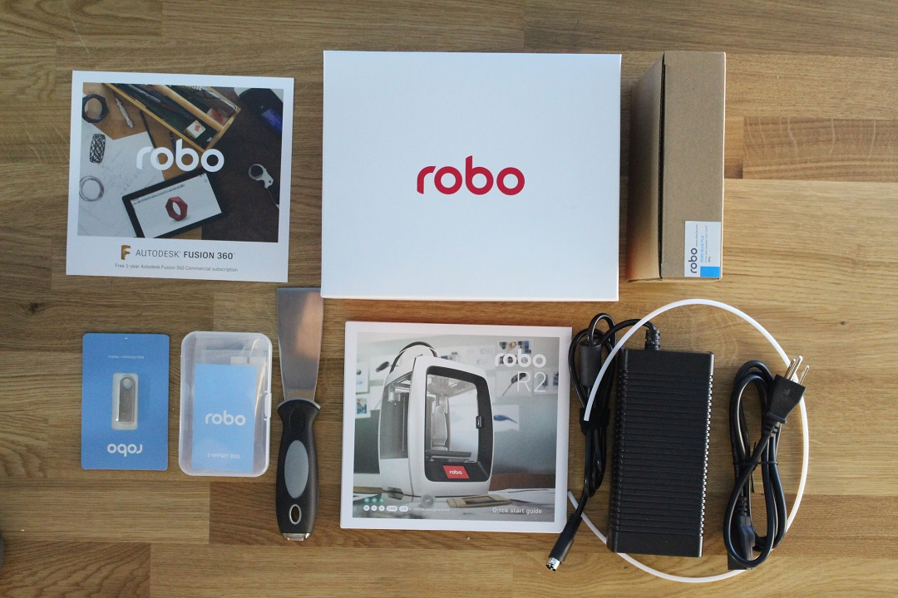

Register your Robo R2
---------------
Before you start, please register your Robo R2 for any servicing or warranty needs if they’re ever required. You can register your product by visiting our registration_site_.

.. _registration_site: https://www.robo3d.com/register

Unboxing Robo R2
---------------

Now that you've received your Robo R2, it's time to unbox it and get familiar with your printer and accessories.

Your R2 is housed in 2 styrofoam pieces, secured together by a top and bottom box. Simply undo the 3 clips at the bottom of the box by pinching in and pulling, then slip the top box off.

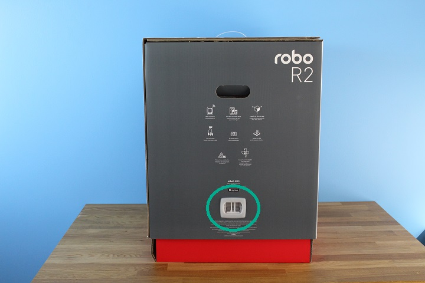

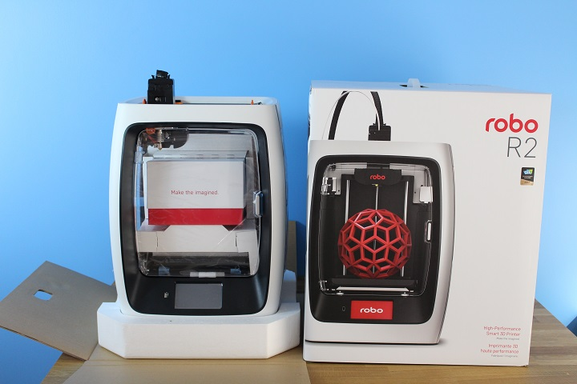

Finally, using the handholds on the bottom of your R2, lift the printer out of the bottom styrofoam piece.

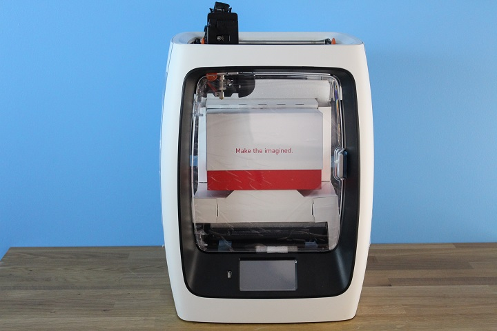

.. tip:: Save your printer box, foam inserts, and inclusions box for transportation. Also, you might need the original packaging to exercise your warranty or ship your printer in the future.

The printer's accessories are stored in the inclusions box inside the printer. First, you will need to take off the zip tie securing the door shut to access this inclusions box.

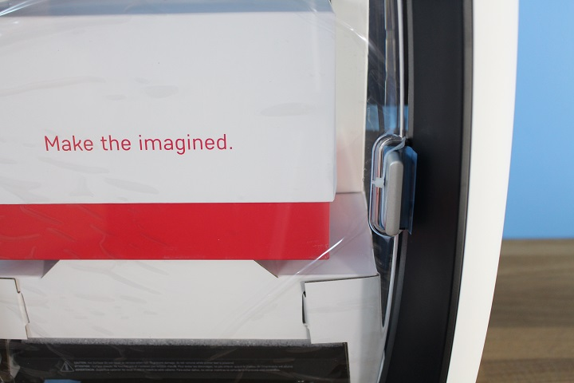

Now, simply slide the inclusion box out and be sure to remove the inner packaging.

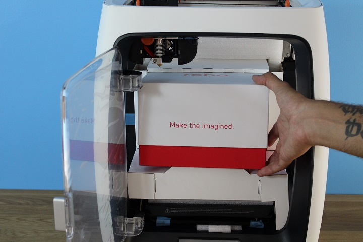

Now we are ready to take off the additional shipping material and zip ties. Remove the inner packing material.

.. image:: images/inner-top-foam-out.JPG
   :alt: Packing out
   :align: center

.. image:: images/top-box-out.JPG
   :alt: Top Box Out
   :align: center

 There are 4 orange rod holders that need to be taken off. There is one at each corner of the top gantry. Simply push on the clip and it will come off.

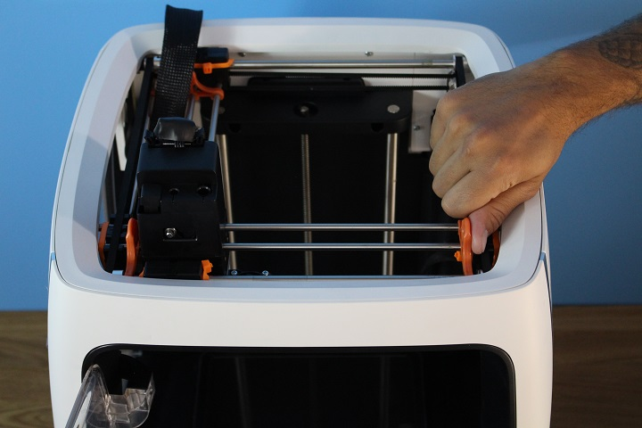

Next, remove the zipties securing the rods to their plastic brackets.

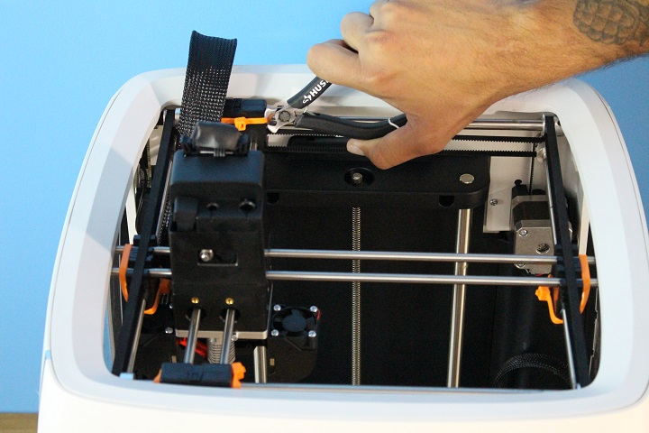

Initial set-up
---------------

Now let’s move forward with your initial set-up of Robo R2.

Inside the toolbox you will find the hotend cover. Go ahead and take that out and place it over the hotend. It is held in with magnets so it just pops right in.

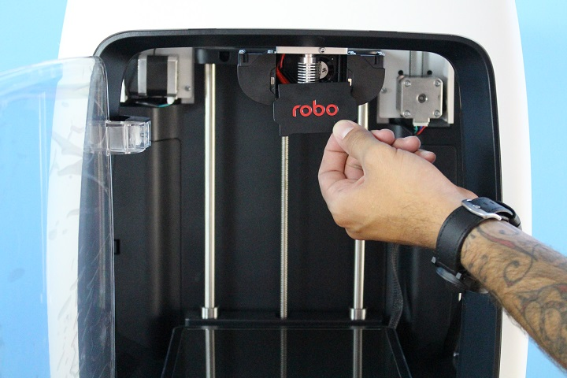

From here you’ll want to connect the power cord to the designated area on the back of the printer and then plug it into an AC outlet.

Now go ahead and turn on the printer.

It is necessary connecting Robo R2 to your Wi-Fi network. Doing so provides you with necessary updates that allows for a more enjoyable 3D printing experience.

.. note:: You can also use the provided Ethernet cable (LAN) to connect Robo R2 directly to your Wi-Fi network.

To begin connecting to your Wi-Fi network, Select UTILITIES on home screen.

.. image:: images/SelectUtilities.png
   :alt: Select Utilities on Home Screen
   :align: center

Select NETWORK.

.. image:: images/Selectnetwork.png
   :alt: Select Network on Home Screen
   :align: center

Select CONFIGURE WIFI.

.. image:: images/selectconfigurewifi.png
   :alt: Select Configure Wi-Fi on Home Screen
   :align: center

Then select your Wi-Fi network and use the on-screen keyboard to enter your password.

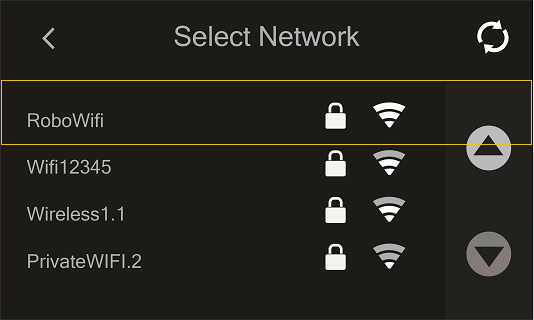

Once you’re done, select CONNECT.

.. image:: images/5.5.png
   :alt: Select Connect
   :align: center

Now, you will need to update Robo R2.

Select UTILITIES

.. image:: images/SelectUtilities.png
   :alt: Select Utilities on Home Screen
   :align: center

Then select UPDATE

Update to the latest version and wait about a minute to get everything up-to-date.

Calibration and setting Z offset
---------------

Next you’ll want to calibrate Robo R2 by selecting UTILITIES on the touch screen, and then select WIZARDS from the list.

.. image:: images/SelectUtilities.png
   :alt: Select Utilities on Touch Screen
   :align: center

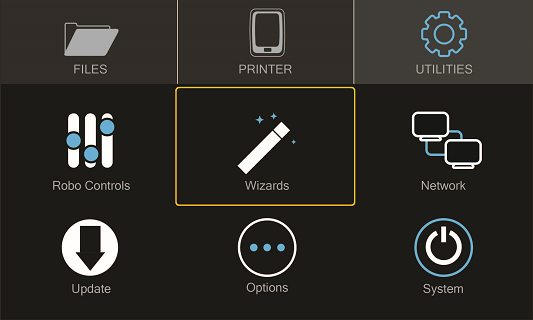

From here you’ll select Z OFFSET WIZARD.

.. image:: images/SelectZOffset.png
   :alt: Select Z Offset Wizard
   :align: center

Now, the printer will wait to calibrate its home position.

.. image:: images/Homing-z-offset.gif
   :alt: Homing Z Offset
   :align: center

Press up and down on the arrow buttons while sliding the calibration card between the nozzle and the print bed until you feel some slight resistance against the paper.

.. image:: images/z-offset-move.gif
   :alt: Homing Z Offset
   :align: center

Press FINISHED

Note that you will see the offset progress and completion on the touchscreen.

You can also fine-tune your offset by going to Utilities> Wizards> Fine Tune Offset

Loading filament
---------------

Now, unhinge the spool holder by simply pushing on the top of the higher lever from the rear of the printer.

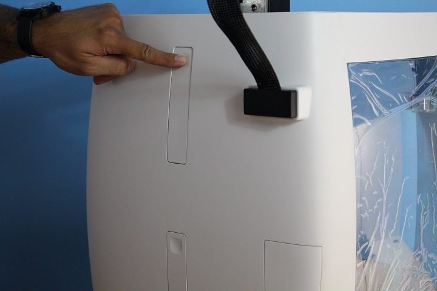

To begin loading filament, hang your filament spool on the top spool holder. Be sure to unroll at least 11”— or 30 centimeters — of filament and cut the tip with a pair of scissors. Thread it through the base of the filament sensor block and into the filament feed tube.

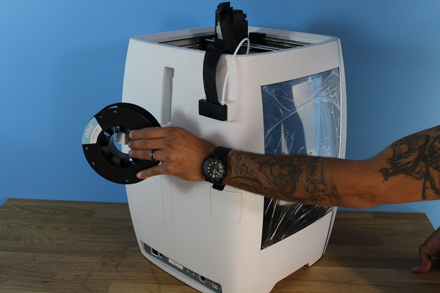

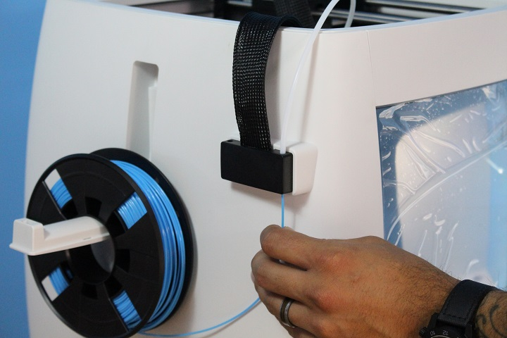

Continue feeding the filament through the filament feed tube until it reaches the extruder. Then, press the extruder lever arm and feed the filament into the printer’s gears.

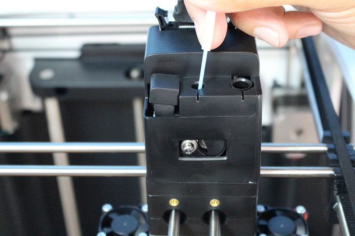

Now select UTILITIES on the touch screen.

.. image:: images/SelectUtilities.png
   :alt: Select Utilities on Touch Screen
   :align: center

Then select WIZARDS from the list.

Finally, select FILAMENT LOADING WIZARD.

.. image:: images/SelectFilamentLoading.png
   :alt: Select Filament Loading Wizard
   :align: center

Follow the on-screen prompts:

- Heating up the printer
- Ensuring you’ve cut off the tip of the filament
- Now, look for filament to exit the nozzle

.. image:: images/Filament-coming-from-nozzle.gif
   :alt: Filament coming from nozzle
   :align: center

- Press NEXT, and
- Press FINISHED

The test print
---------------

To create your first test print Select FILES on the home screen. Then select a file to print from the list.

.. image:: images/4.1.png
   :alt: Select Files on Home Screen
   :align: center

Now, select START to print—and be sure to wait several seconds while Robo C2 prepares to print the file.

.. image:: images/4.2.png
   :alt: Select Start
   :align: center

The file will start printing.

.. image:: images/4.3.png
   :alt: File Printing
   :align: center

Just note that you can select PAUSE to pause your print, or you can select CANCEL to cancel your print.

.. image:: images/4.4.png
   :alt: Pause and Cancel Options
   :align: center

Removing the test print
---------------

When the test print is complete and cooled down, use the provided spatula to carefully remove the print at its borders. Then slowly work your way underneath the print until it’s loose. Don’t force the print loose by pulling it up directly up from the print bed, since this may cause your print to break.

.. image:: images/Removing-Print.gif
   :alt: Removing Print From Bed
   :align: center

Using Hotspot Mode
---------------

Your printer is capable of starting If no Wi-Fi signals are available for connection, you can use Hotspot Mode to emit a Wi-Fi signal from Robo R2 in order to connect to it wirelessly from your smart device. To access Hotspot Mode, do the following:

   1. Select “Utilities” on the home screen of the Robo C2 touch screen
   2. Select “Network” from the list
   3. Select “Start Hotspot Mode” from the list
