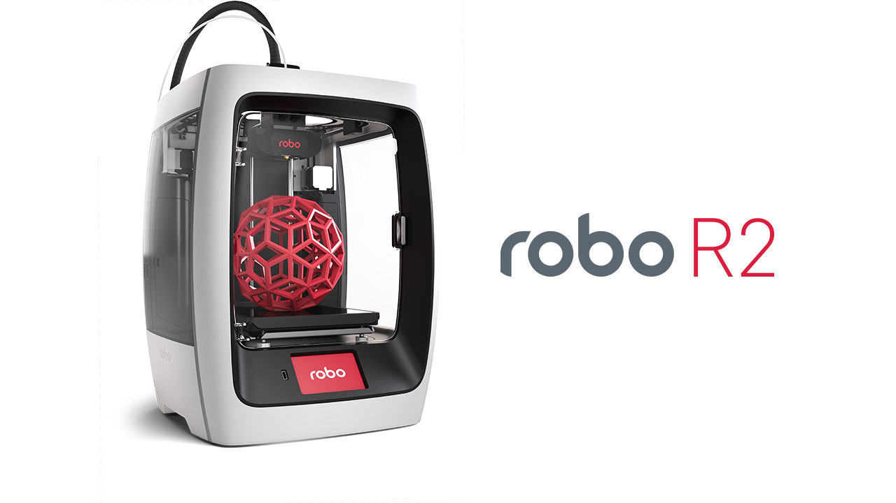

.. Sphinx RTD theme demo documentation master file, created by
   sphinx-quickstart on Sun Nov  3 11:56:36 2013.
   You can adapt this file completely to your liking, but it should at least
   contain the root `toctree` directive.

======
Robo R2
======

**Enter the Robolution**

Greetings, Maker!

Thank you for your purchase and welcome to the Robo family! We really love 3D printing and our aim is to get this amazing technology into the hands of as many people as possible to see what awesome creations spring from your imagination.

Here you’ll find all of the information you need for a seamless 3D printing experience with Robo R2. This next-generation 3D printer includes a wish-list set of innovative features required in a modern, connected smart device to make 3D printing fun, easy and accessible to everyone.

To get the most from your Robo R2, please review the full manual.

Happy Printing,

Coby Kabili and Braydon Moreno, Robo Co-founders

**Make more with Robo R2**

The Robo R2 high-performance smart 3D printer with Wi-Fi gives you the freedom to make whatever you can imagine right from your mobile device using the Robo app.

   * Built for serious printing
   * Sizeable 8 x 8 x 10 in print size
   * 5” built-in color touch screen
   * On-board camera for remote print monitoring
   * Class-leading print speed
   * Removable, heated and automatic self-leveling print bed
   * Ability to add an additional extrusion head and print two materials at once
   * Prints 30+ materials types

.. toctree::
   :maxdepth: 2

   getting started/index.rst
   operation/index.rst
   maintenance/index.rst
   Troubleshooting/index.rst
   assembly/index.rst
