.. Sphinx RTD theme demo documentation master file, created by
   sphinx-quickstart on Sun Nov  3 11:56:36 2013.
   You can adapt this file completely to your liking, but it should at least
   contain the root `toctree` directive.

=================================================
Operation
=================================================

.. image:: images/r2-operation.jpg
   :alt: Operation Header
   :align: center

-----------
Display Screen
-----------

The color touch screen display on the front of your Robo R2 is the main access point for setting up, controlling, and reviewing all components of your 3d printer. You can navigate through the menus by touch or a stylus.

Files
   -Here you are able to navigate through your files, whether they are on a usb thumb drive or on the local hard drive internally.

Printer
   -The print screen is the default screen when printing. This will show you file printing, temperatures, a progress indicator, error messages, and pause and cancel buttons while in use.

Utilities
   -The Utilities menu offers a variety of options including: fan controls, z-offset wizard, network settings, and a way to update your printer.

-----------
Setting the Z offset
-----------

Here we will calibrate Robo R2 by setting the Z-Offset and making sure your first layer is applied correctly.  We will be covering three ways of zeroing in on your Offset.  The first is the Z-Offset Wizard found in Utilities> Wizards; the second is the Fine Tune Wizard, also under Utilities> Wizards; the final is manually adjusting your Offset in the EEPROM manager.

What is "Z-Offset"?  Simply, its the distance between your nozzle and your print bed when the print bed is at home (bottom of printer), which is technically known as a Home Offset.  This offset can change by adjusting the bed springs, not seating your print bed correctly, or even a shifting hotend.

Z-Offset Wizard
----------------

From the home screen select "Utilities"

.. image:: images/select-utilities-r2.png
   :alt: Select Utilities on Touch Screen
   :align: center

Then select "Wizards"

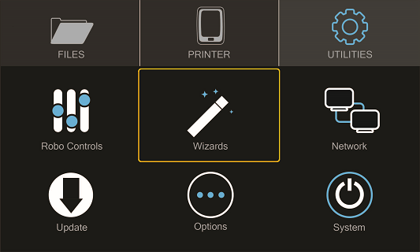

Next select "Z-Offset Wizard"

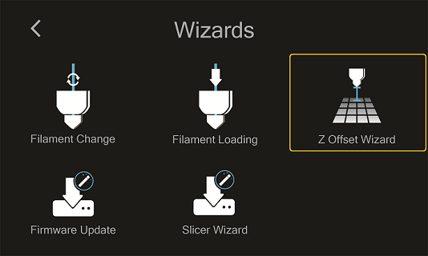

Your printer will now home itself and get in position to set your offset.

Follow the directions on the screen by using the calibration card or a standard sheet of paper. Press on the 'Up' arrow to raise the bed up toward the nozzle of the printer. Slide the calibration card in between the nozzle and bed and continue pressing the 'Up" button until you feel little resistance on the card between the Nozzle and the print bed. Note: You still want to be able to slide the calibration card back and forth but with enough resistance that it is touching both the bed and the nozzle.

Select 'Finished". Your printer will calculate your Z-Offset and then press 'Finished' to complete setting your Z-Offset.

Fine Tune Wizard
----------------

If you are experiencing the nozzle dragging (too low) or your prints are not sticking (too high), you can fine-tune your Z-Offset by going to Utilities> Wizards> Fine Tune Wizard.  It's a little more work, but you will tune your offset by actually printing on the bed! Your Robo R2 will print a series of vertical lines, one at a time.  Between each pass you can increase or decrease the Z-Offset value as needed.

Manually setting Offset in EEPROM Manager
----------------

If you are a printing veteran and are comfortable with manually setting your Offset, you can do so under Utilities> Options> EEPROM> Home Offset. In the "Z" screen you will see the value of your current Offset, as well as two arrows that will increase or decrease this value.  The arrows are arranged so that they correspond with raising or lowering the bed.  A smaller value brings the bed closer to the nozzle, while a larger value increases the distance away.

If your Offset seems close but prints are still not sticking, you can decrease the value by 0.1mm - 0.2mm and try again.  Generally only small changes may be needed.

-----------
Loading and Unloading Filament
-----------

**Loading filament**

Now, unhinge the spool holder by simply pushing on the top of the higher lever from the rear of the printer.

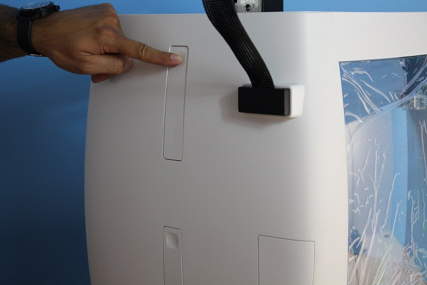

Next, insert the filament feed tube into the filament sensor block.

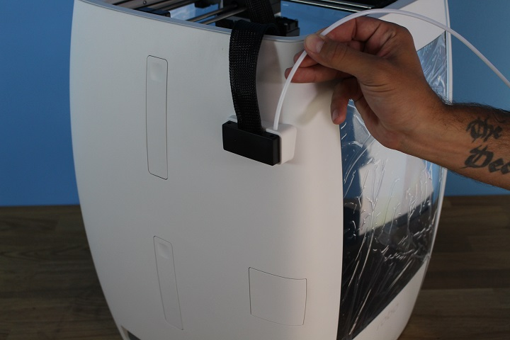

To begin loading filament, hang your filament spool on the top spool holder. Be sure to unroll at least 11”— or 30 centimeters — of filament and cut the tip with a pair of scissors. Thread it through the base of the filament sensor block and into the filament feed tube.

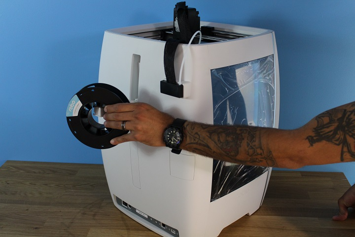

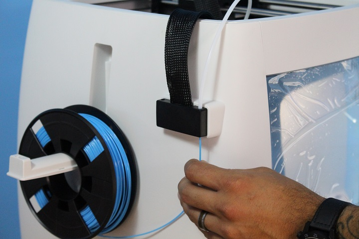

Continue feeding the filament through the filament feed tube until it reaches the extruder. Then, press the extruder lever arm and feed the filament into the printer’s gears.

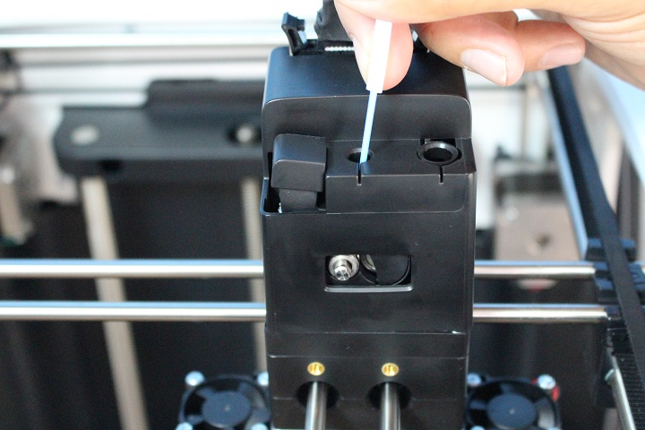

Now select UTILITIES on the touch screen.

.. image:: images/select-utilities-r2.png
   :alt: Select Utilities on Touch Screen
   :align: center

Then select WIZARDS from the list.

Finally, select FILAMENT LOADING WIZARD.

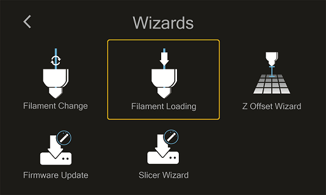

Follow the on-screen prompts:

- Heating up the printer
- Ensuring you’ve cut off the tip of the filament
- Now, look for filament to exit the nozzle
- Press NEXT, and
- Press FINISHED

**Unloading Filament**

  1. From the home screen select 'Utilities'
  2. Next, select 'Wizards'
  3. Select 'Filament Change Wizard'
  4. After you printer heats up, the feeder gear will start to retract the filament from the nozzle
  5. Once you see filament coming out of the top of the extruder, select 'Next' and 'Finished'

-----------
Starting a print
-----------

**Starting a print from your internal storage**

Select 'Files' from the home screen, then select a file you would like to print.

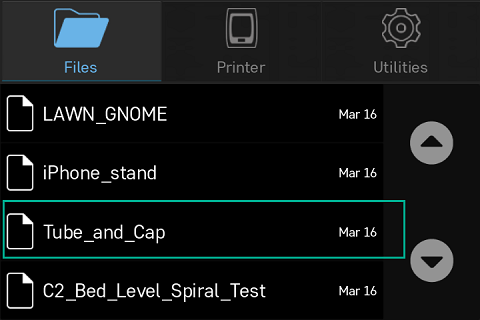

Now select 'Start' to print - and be sure to wait several second while the Robo C2 prepares to print the file

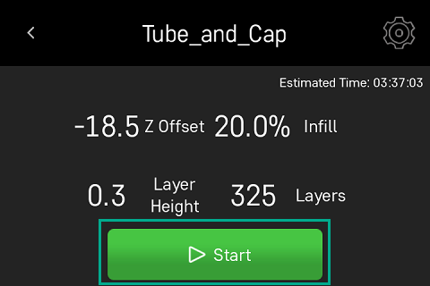

Note; you can select 'Pause' to pause your print, or you can select 'Cancel' to cancel your print

.. image:: images/printing-r2.png
   :alt: Printing Screen
   :align: center

Note; you can change the nozzle temperature by pressing on the extruder and adding in your desired temperature

Starting a print from a USB flash drive
   1. Insert the USB flash drive into the USB slot on the front of the printer
   2. Select 'Files' from the home screen
   3. Select the USB folder that will appear at the top of the list
   4. Select which file you would like to print
   5. Next, you can choose whether or not you would like to download the file directly to the printer or print directly from the USB
   6. Finally, select 'Start' to start the print

-----------
Printing from USB
-----------

Using on-board slicing
----------------

1. Download a 3D model print file to your computer (stl) and copy the file onto USB drive.

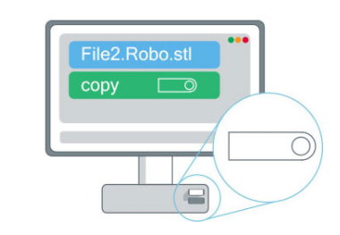

2. Eject USB drive from computer.

.. image:: images/eject.png
   :alt: eject usb
   :align: center

3. Insert USB drive into the USB port on the front of the printer.

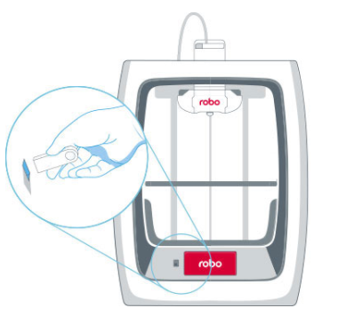

4. Select UTILITIES from the touch screen.

.. image:: images/select-utilities-r2.png
   :alt: Select Utilities
   :align: center

5. Select WIZARDS.

6. Then, select SLICING WIZARD.

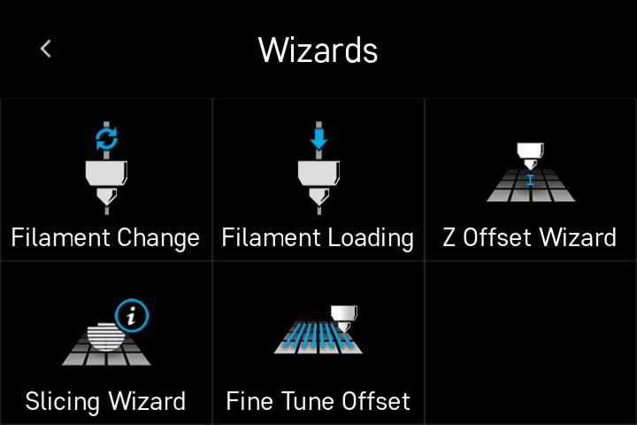

7. Follow steps on-screen: CONTINUE > USB FOLDER > select file

.. image:: images/slicing-wizard-1.png
   :alt: Slicing Wizard
   :align: center

8. Choose if you want to add supports or rafts (both show as automatically selected).

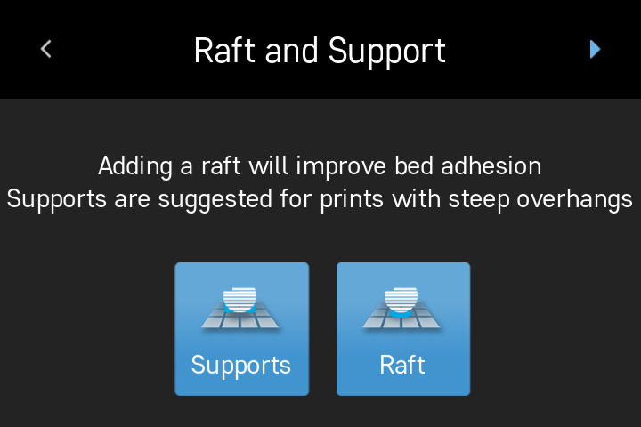

9. Select print quality (standard is .15mm which is automatically selected).

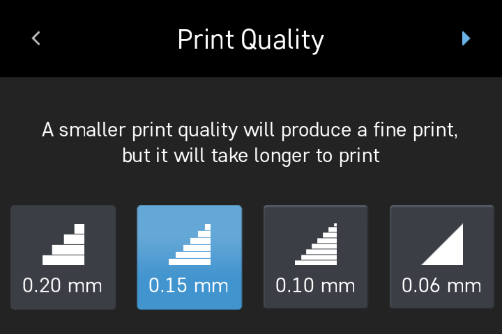

10. Select infill (10% is automatically selected).

.. image:: images/slicing-wizard-5.png
   :alt: Slicing Wizard
   :align: center

11. Select print material (PLA is automatically selected).

.. image:: images/slicing-wizard-6.png
   :alt: Slicing Wizard
   :align: center

12. Press the top right corner for NEXT.
13. Print will then begin slicing.

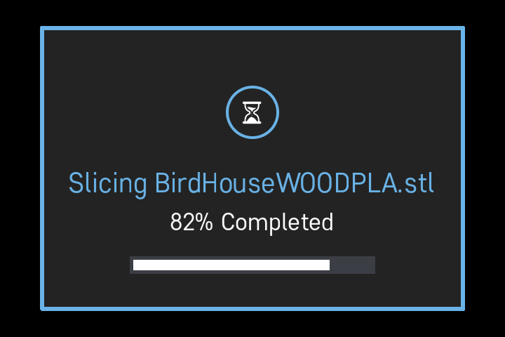

14. Once slicing is complete, you have the option to save the file onto your printer. Select where you want to save the file by pressing on the top right SAVE icon.

.. image:: images/slicing-wizard-8.png
   :alt: Slicing Wizard
   :align: center

15. Press DONE to save you file.

.. image:: images/slicing-wizard-9.png
   :alt: Slicing Wizard
   :align: center

16. Go to FILES
17. Search for where you saved your file, then select that file.
18. Press START and your print will begin.

Using sliced gcode file
----------------

1. Download a 3D model print file to your computer (gcode) and copy file onto USB drive.

2. Eject USB drive from computer.

.. image:: images/eject.png
   :alt: eject usb
   :align: center

3. Insert USB drive into the USB port on the front of the printer.

4. Select FILES from the touch screen.

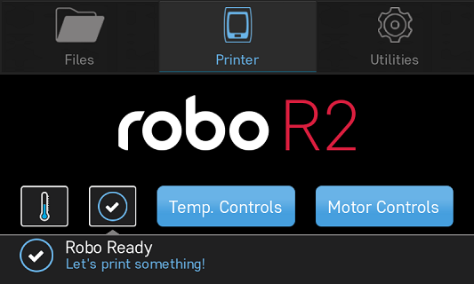

5. Then, select USB folder from the list.

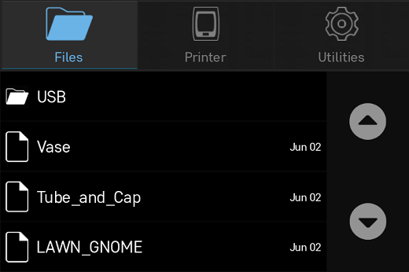

6. Select the file you would like to print.

.. image:: images/usb-folder-2-c2.png
   :alt: USB folder 2
   :align: center

7. Next, choose whether you would like to upload the file directly to the printer or print directly from the USB.

.. image:: images/print-or-save.png
   :alt: print or save
   :align: center

8. Finally, select START to start the print.

-----------
Printing from a Chromebook
-----------

Easily print from and control Robo R2 with your Chromebook or any web browser

**Connect Robo R2 to Wi-Fi**

1. First step is to connect your Robo R2 to Wi-Fi, as well as your Chromebook to the same Wi-Fi network.
2. Select UTILITIES > NETWORK > CONFIGURE WI-FI. Select your Wi-Fi network, and type in the password to connect.

.. image:: images/select-utilities-r2.png
   :alt: Select Utilities
   :align: center

.. note:: Ensure your Chromebook is connected to the same Wi-Fi network as your Robo R2

**Find a File to Print**

1. Next, go to a 3D file marketplace on your computer and find a file you want to print.
2. Download the file.

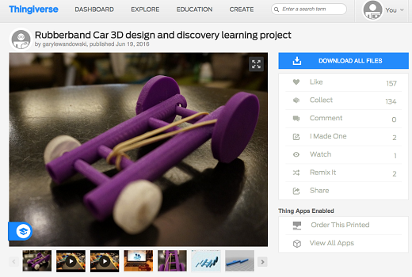

**Find Your IP Address**

1. Next step is to find your IP address which you will use in the next step.
2. Select UTILITIES > NETWORK > NETWORK STATUS > IP

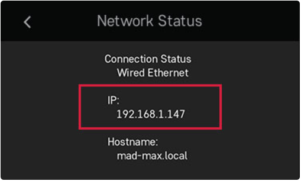

**Access Web Dashboard**

1. Open another browser tab and type in the unique IP address of your Robo R2 from the previous step.
2. You should be connected to your web dashboard immediately.

**Upload a File**

1. To upload a file, clock on the upload button on the left hand side of the dashboard.
2. Select the file that you just downloaded.

.. image:: images/upload-file-button.PNG
   :alt: Upload File Button
   :align: center

**Choose Slicing Profile**

1. Once you upload a file, the slicing settings will pop up.
2. Choose a slicing profile (we recommend Low Quality)
3. Change the after slicing section to 'begin printing'
4. It will automatically send the file to your printer and begin printing.

.. image:: images/stl-slicing.PNG
   :alt: stl slicing
   :align: center

**Monitoring Your Print**

1. You can monitor your print in the upper left hand corner of the dashboard.
2. You can see thinks like which file is printing, and how much time is left until completion.

**Removing Print**

1. Once your print is complete on Robo R2, wait 5-10 minutes until the print bed cools and then safely remove it from the platform by using the included spatula to loosing it form the print bed.
2. Enjoy your new 3D print!

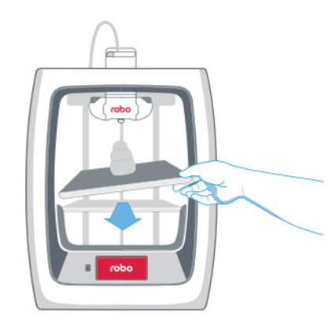

-----------
Print Status
-----------

There are three ways to check on the status of your print while your Robo R2 is at work printing away

Screen
   * While your Robo C2 is printing, you can simply check the status by selecting 'Printer' on the home screen. This will indicate the name of the file printing, what percentage done your print is, a progress indicator, along with the nozzle temperature and any error messages you may have encountered.

.. image:: images/printing-r2.png
   :alt: Printing Screen
   :align: center

Robo App
   * If you have the Robo App, you can check on the status of your print by selecting the printer under the 'Dashboard' tab This will indicate the name of the file printing, what percentage done your print is, along with the nozzle temperature

.. image:: images/iosstatus.jpeg
   :alt: iOS Screen
   :align: center

Web app
 * If you have a web browser on your computer or mobile device, you can check on the status of your print by navigating to its IP address in the navigation bar of the browser
 * To see the IP address of your printer, select 'Utilities' from the home screen

.. image:: images/select-utilities-r2.png
   :alt: Select Utilities
   :align: center

* Next select 'Network'

.. image:: images/Selectnetwork.png
   :alt: Select Network
   :align: center

* Then select 'Network Status' and note the IP address of your Robo C2

.. image:: images/Selectnetworkstatus.png
   :alt: Select Network Status
   :align: center

* Copy that number into your browser navigation bar, and it will bring you to a web app to see all things with your Robo R2

-----------
Using print bed adhesion
-----------

The Robo R2 has a print bed adhesion PEI plate already installed with your printer. These will usually last about 4-6 months depending on use.
   - In order to make sure you get good adhesion of your print, make sure to wipe the print bed adhesion with a damp cloth before every print.
   - If your prints have a hard time sticking to the bed, you can use a method to roughen the surface by using a 2000 grit sand paper and lightly sanding the top surface then cleaning off with a damp cloth.

------------
Removing the print
------------

   1. When the Print is completed, wait for the printer to completely cool down.
   2. Take the provided spatula to carefully remove the print at its borders.
   3. Then slowly work your way underneath the print until it’s loose. Don’t force the print loose by pulling it up directly up from the print bed, since this may cause your print to break.
   4. Carefully remove the print from the print plate with your hand.

-----------
Setting Up Wifi
-----------
To begin connecting to your Wi-Fi network, Select UTILITIES on home screen.

.. image:: images/select-utilities-r2.png
   :alt: Select Utilities on Home Screen
   :align: center

Select NETWORK.

.. image:: images/Selectnetwork.png
   :alt: Select Network on Home Screen
   :align: center

Select CONFIGURE WIFI.

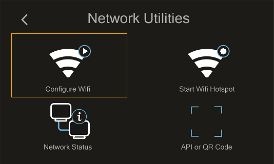

Then select your Wi-Fi network and use the on-screen keyboard to enter your password.

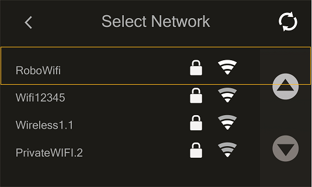

Once you’re done, select CONNECT.

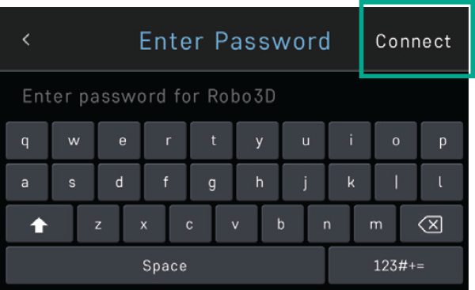

Your printer is capable of starting a Wi-Fi hotspot. If no Wi-Fi signals are available for connection, you can use Hotspot Mode to emit a Wi-Fi signal from Robo R2 in order to connect to it wirelessly from your smart device. To access Hotspot Mode, do the following:

Hotspot Mode
   1. Select “Utilities” on the home screen of the Robo R2 touch screen
   2. Select “Network” from the list
   3. Select “Start Hotspot Mode” from the list
   4. Your Robo R2 is now casting it's own wireless network

-----------
Your printer's WiFi password
-----------
The password for your printer's hotspot (AP mode) is the same as your printer's serial name.  For example: careful-curie.
You can change the password

-----------
Downloading the Robo App
-----------
From your iOS Device
   1. Open the App Store app
   2. On the bottom dock, tap on search
   3. Enter “Robo App”
   4. Tap on the Robo App
   5. Tap download on the right of the icon, and rate us 5 stars if you like it!

-----------
Connecting your iOS device to your Robo R2
-----------
Connecting via a local wifi network
   1. Make sure your smart device is connected to the same wifi network as your Robo R2
   2. In the ‘Dashboard’ screen of the Robo App, tap ‘+Add a Printer’ in the middle of the screen
   3. Select ‘Scan for Printer Name/IP’
   4. A pop up will appear with all of the printers on the same network as your smart device, go ahead and select which printer you would like to add (your printer has a unique name, example - Curious Tesla, or Brilliant Einstein). (You may look on the back of your printer and find out which name your printer has been given).
   5. Now you will need to scan the QR code on your screen to fully connect the 3d printer to your smart device.

		+ On the screen of your machine, select  ‘Utilities’
		+ Select ‘network’
		+ Select ‘QR Code’
   6. Tap on ‘Scan Printer Barcode for Key’
   7. Point your camera at the barcode and wait for the app to recognize the 3d printer
   8. Tap ‘add printer’ at the bottom of the screen
   9. Congratulations, you have now added your Robo R2 to your app
   10. note that you can add multiple machines to the same app, and control each one independently

Connecting via Hotspot Mode
   1. Make sure that you are connected to the wifi signal that the machine is emitting
   2. Follow steps in the previous section to successfully connect your printer to the app

-----------
Updating Your Printer
-----------
Make sure to update your printer to grab the benefits of all the latest Robo has to offer, as well as making sure your Robo R2 performs to the best of its ability.

Select UTILITIES

.. image:: images/select-utilities-r2.png
   :alt: Select Utilities on Home Screen
   :align: center

Then select UPDATE

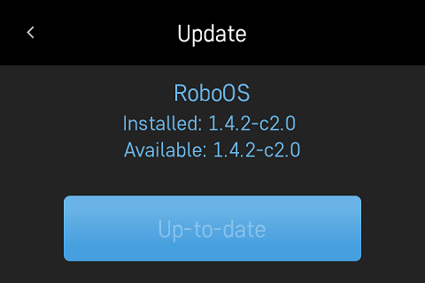

Update to the latest version and wait about a minute to get everything up-to-date. If your Robo R2 is already up to date, the button will be greyed out and say 'up to date'.
