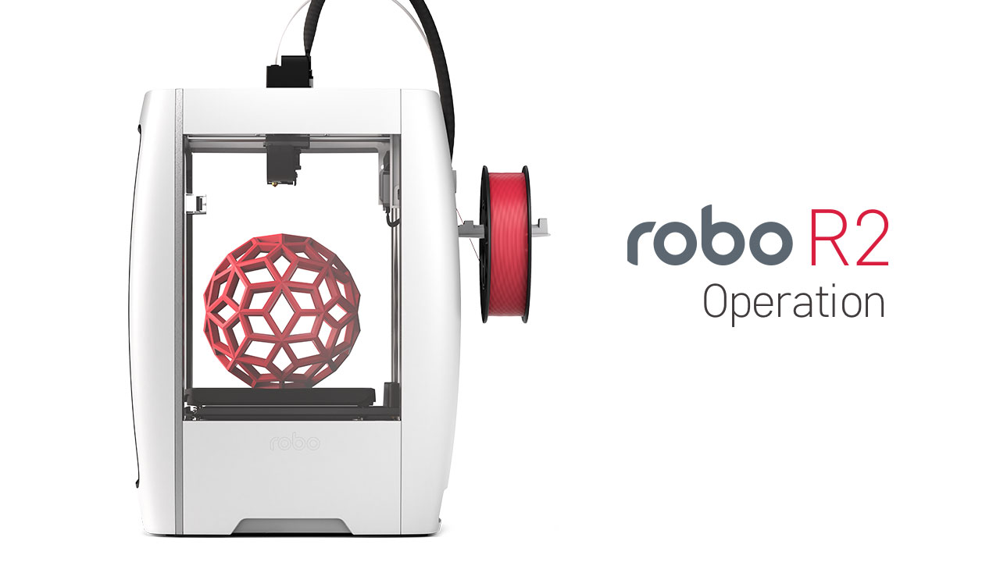
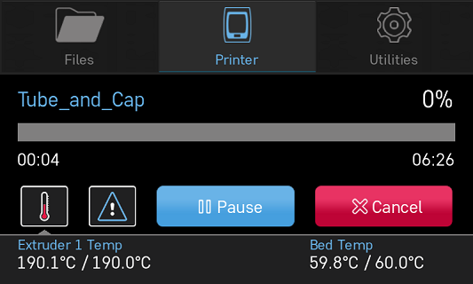
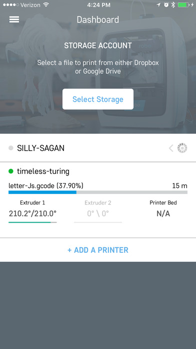
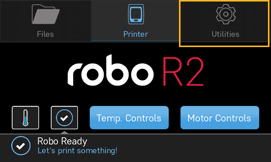
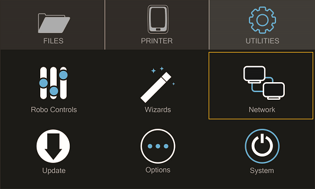

.. Sphinx RTD theme demo documentation master file, created by
   sphinx-quickstart on Sun Nov  3 11:56:36 2013.
   You can adapt this file completely to your liking, but it should at least
   contain the root `toctree` directive.

=================================================
Operation
=================================================

-----------
Display Screen
-----------

The color touch screen display on the front of your Robo R2 is the main access point for setting up, controlling, and reviewing all components of your 3d printer. You can navigate through the menus by touch or a stylus.

Files
   -Here you are able to navigate through your files, whether they are on a usb thumb drive or on the local hard drive internally.

Printer
   -The print screen is the default screen when printing. This will show you file printing, temperatures, a progress indicator, error messages, and pause and cancel buttons while in use.

Utilities
   -The Utilities menu offers a variety of options including: fan controls, z-offset wizard, network settings, and a way to update your printer.

-----------
Setting the Z offset
-----------

Here we will calibrate Robo R2 by setting the Z-Offset and making sure your first layer is applied correctly.  We will be covering three ways of zeroing in on your Offset.  The first is the Z-Offset Wizard found in Utilities> Wizards; the second is the Fine Tune Wizard, also under Utilities> Wizards; the final is manually adjusting your Offset in the EEPROM manager.

What is "Z-Offset"?  Simply, its the distance between your nozzle and your print bed when the print bed is at home (bottom of printer), which is technically known as a Home Offset.  This offset can change by adjusting the bed springs, not seating your print bed correctly, or even a shifting hotend.

Z-Offset Wizard
----------------

Select UTILITIES on the touch screen. Then select WIZARDS from the list. From here you’ll select Z OFFSET WIZARD. Now, the printer will wait to calibrate its home position.

.. image:: images/z-offset-wizard-r2.gif
   :alt: Bed to zero
   :align: center

.. image:: images/bed-to-zero-r2.gif
   :alt: Bed to zero
   :align: center

Follow the directions on the screen by using the calibration card or a standard sheet of paper. Press on the 'Up' arrow to raise the bed up toward the nozzle of the printer. Slide the calibration card in between the nozzle and bed and continue pressing the 'Up" button until you feel little resistance on the card between the Nozzle and the print bed. Note: You still want to be able to slide the calibration card back and forth but with enough resistance that it is touching both the bed and the nozzle.

.. image:: images/bed-calibration-r2.gif
   :alt: Bed Calibration
   :align: center

If your bed is too high and the calibration card does not have enough room to slide between the nozzle and the bed, press the down arrow until the calibration card can pass freely but with a slight resistance between the nozzle and the bed.

.. image:: images/bed-offset-too-high-r2.gif
   :alt: Offset too high
   :align: center

Fine Tune Wizard
----------------

If you are experiencing the nozzle dragging (too low) or your prints are not sticking (too high), you can fine-tune your Z-Offset.  It's a little more work, but you will tune your offset by actually printing on the bed to get the perfect height. Your Robo R2 will print a series of vertical lines, one at a time.  Between each pass you can increase or decrease the Z-Offset value as needed. To use the fine-tune offset wizard, follow these steps below:

Note: It is very important to make sure that the print bed is level by adjusting the thumb screws below the print bed before starting this wizard.

1. To start, select 'Utilities' from the home screen, then select 'Fine tune offset'. Select the material currently loaded in the printer. Then the wizard will ask you which corner you'd like to start from. This simply sets where the printer will start printing out the test lines. You can start from whichever corner you prefer.

.. image:: images/fine-tune-1.gif
   :alt: Fine tune 1
   :align: center

2. Once the printer homes and positions itself to begin testing, you will see a visual reference on the screen to help you know what to look for in order to find an ideal Z-Offset value.

.. image:: images/fine-tune-2.gif
   :alt: Fine tune 2
   :align: center

3.  You will come to the "Adjust Offset" screen, where you can set the adjustment increment, move the bed up or down, and test the offset. We recommend testing the offset first so you can get a visual reference to fine tune the current offset. Move the bed up and down with the provided buttons on screen, and test with the 'test offset' button to see if it looks satisfactory.

.. image:: images/fine-tune-3.gif
   :alt: Fine tune 3
   :align: center

4.  When you've found a satisfactory Z-Offset value, press the forward arrow in the top right corner and select 'Save' to finish the wizard.

.. image:: images/fine-tune-4.gif
   :alt: Fine tune 4
   :align: center

Manually setting Offset in EEPROM Manager
----------------

If you are a printing veteran and are comfortable with manually setting your Offset, you can do so under Utilities> Options> EEPROM> Home Offset. In the "Z" screen you will see the value of your current Offset, as well as two arrows that will increase or decrease this value.  The arrows are arranged so that they correspond with raising or lowering the bed.  A smaller value brings the bed closer to the nozzle, while a larger value increases the distance away.

If your Offset seems close but prints are still not sticking, you can decrease the value by 0.1mm - 0.2mm and try again.  Generally only small changes may be needed.

-----------
Loading and Unloading Filament
-----------

**Loading filament**

Now, unhinge the spool holder by simply pushing on the top of the higher lever from the rear of the printer. Next, insert the filament feed tube into the filament sensor block.

.. image:: images/spool-on-r2.gif
   :alt: Unhinge Spool Holder
   :align: center

To begin loading filament, hang your filament spool on the top spool holder. Be sure to unroll at least 11”— or 30 centimeters — of filament and cut the tip with a pair of scissors. Thread it through the base of the filament sensor block and into the filament feed tube.

.. image:: images/insert-filament-r2.gif
   :alt: Unhinge Spool Holder
   :align: center

Now select UTILITIES on the touch screen. Then select WIZARDS from the list. Finally, select FILAMENT LOADING WIZARD. The on-screen prompts should guide you to loading your filament.

.. image:: images/fil-loading-screen-r2.gif
   :alt: Unhinge Spool Holder
   :align: center

Continue feeding the filament through the filament feed tube until it reaches the extruder. Then, press the extruder lever arm and feed the filament into the printer’s gears.

.. image:: images/fil-load-2-r2.gif
   :alt: Filament In Extruder
   :align: center

The filament drive gear should push the filament down, into the nozzle, and out the other end. Once you see this, press NEXT on the screen, then press DONE.

.. image:: images/fil-load-3-r2.gif
   :alt: Filament In Extruder
   :align: center

**Unloading Filament**

  1. From the home screen select 'Utilities'
  2. Next, select 'Wizards'
  3. Select 'Filament Change Wizard'
  4. After you printer heats up, the feeder gear will start to retract the filament from the nozzle
  5. Once you see filament coming out of the top of the extruder, select 'Next' and 'Finished'

-----------
Start a print
-----------

**Starting a print from your internal storage**

To create your print Select FILES on the home screen. Then select a file to print from the list. Now, select START to print—and be sure to wait several seconds while Robo R2 prepares to print the file.

.. image:: images/test-print-screen-r2.gif
   :alt: Select Files on Home Screen
   :align: center

Note; that you can select PAUSE to pause your print, or you can select CANCEL to cancel your print.

Note; you can change the nozzle temperature by pressing on the extruder and adding in your desired temperature

Starting a print from a USB flash drive
   1. Insert the USB flash drive into the USB slot on the front of the printer
   2. Select 'Files' from the home screen
   3. Select the USB folder that will appear at the top of the list
   4. Select which file you would like to print
   5. Next, you can choose whether or not you would like to download the file directly to the printer or print directly from the USB
   6. Finally, select 'Start' to start the print

-----------
Print Status
-----------

There are three ways to check on the status of your print while your Robo R2 is at work printing away

LCD Screen
   * While your Robo R2 is printing, you can simply check the status by selecting 'Printer' on the home screen. This will indicate the name of the file printing, what percentage done your print is, a progress indicator, along with the nozzle temperature and any error messages you may have encountered.

Robo Mobile App
   * If you have the Robo Mobile App, you can check on the status of your print by selecting the printer under the 'Dashboard' tab This will indicate the name of the file printing, what percentage done your print is, along with the nozzle temperature

Web Dashboard
   * If you have a web browser on your computer or mobile device, you can check on the status of your print by navigating to its IP address in the navigation bar of the browser
   * To see the IP address of your printer, select 'Utilities' from the home screen

  * Next select 'Network'

  * Then select 'Network Status' and note the IP address of your Robo C2

.. image:: images/Selectnetworkstatus.png
   :alt: Select Network Status
   :align: center

  * Copy that number into your browser navigation bar, and it will bring you to the web dashboard for your printer.  From here you can slice files, manage plugins, and whole lot more!

-----------
Using print bed adhesion
-----------

The Robo R2 now ships with the Heated Bed v2, which comes with a sheet of BuildTak preinstalled. BuildTak generally does not require adhesives to maintain a good bond with your filament.

   - To ensure you get good adhesion with your print, wipe the print bed surface with a damp cloth before every print.
   - If your prints have a hard time sticking to the bed, clean the print bed surface with isopropyl alcohol and a paper towel to remove any oils that may have built up.

------------
Removing the print
------------

When the print is complete and cooled down, carefully remove the print bed with both hands and set it on a flat surface. Use the provided spatula to carefully remove the print at its borders. Then, slowly work your way underneath the print until it’s loose. Don’t force the print loose by pulling it up directly up from the print bed, since this may cause your print to break.

.. image:: images/removing-print-r2.gif
   :alt: Removing Print
   :align: center

-----------
Setting Up Wifi
-----------

To begin connecting to your Wi-Fi network, Select UTILITIES on home screen. Select NETWORK. Select CONFIGURE WIFI. Then select your Wi-Fi network and use the on-screen keyboard to enter your password. Once you’re done, select CONNECT.

.. image:: images/connect-to-wifi-r2.gif
   :alt: Select Utilities on Home Screen
   :align: center

Your printer is capable of starting a Wi-Fi hotspot. If no Wi-Fi signals are available for connection, you can use Hotspot Mode to emit a Wi-Fi signal from Robo R2 in order to connect to it wirelessly from your smart device. To access Hotspot Mode, do the following:

Hotspot Mode
   1. Select “Utilities” on the home screen of the Robo R2 touch screen
   2. Select “Network” from the list
   3. Select “Start Hotspot Mode” from the list
   4. Your Robo R2 is now casting it's own wireless network

-----------
Your printer's WiFi password
-----------

The password for your printer's hotspot (AP mode) is the same as your printer's serial name.  For example: careful-curie.

-----------
Downloading the Robo App
-----------

From your mobile device
   1. Open the appropriate App Store app (Google Play or App Store)
   2. Tap on search
   3. Enter “Robo 3D”
   4. Tap on the Robo App
   5. Tap download, and don't forget to leave a rating!

-----------
Connecting your mobile device to your Robo R2
-----------

Connecting via a local wifi network
   1. Make sure your smart device is connected to the same wifi network as your Robo R2
   2. In the ‘Dashboard’ screen of the Robo App, tap ‘+Add a Printer’ in the middle of the screen
   3. Select ‘Scan for Printer Name/IP’
   4. A pop up will appear with all of the printers on the same network as your smart device, go ahead and select which printer you would like to add (your printer has a unique name, example - Curious Tesla, or Brilliant Einstein). (You may look on the back of your printer and find out which name your printer has been given).
   5. Now you will need to scan the QR code on your screen to fully connect the 3d printer to your smart device.

		+ On the screen of your machine, select  ‘Utilities’
		+ Select ‘network’
		+ Select ‘QR Code’
   6. Tap on ‘Scan Printer Barcode for Key’
   7. Point your camera at the barcode and wait for the app to recognize the 3d printer
   8. Tap ‘add printer’ at the bottom of the screen
   9. Congratulations, you have now added your Robo R2 to your app
   10. note that you can add multiple machines to the same app, and control each one independently

Connecting via Hotspot Mode
   1. Make sure that you are connected to the Wi-Fi signal that the machine is emitting
   2. Follow steps in the previous section to successfully connect your printer to the app

-----------
Camera on/off
-----------

There are currently three ways to turn your camera on. By default this is off to prevent your internet bandwidth from slowing down. Make sure your Robo R2 is updated with the latest software before proceeding.

LCD Touchscreen
-----------

1. Go to Utilities

2. Click on Options

3. Click on Webcam. Now you can select whether to turn on of off your

Web Dashboard
-----------

1. Click on 'System' in the top right of your web dashboard.

2. Next, click on 'Start Webcam' in from the drop down menu.

3. Finally, refresh your web browser for the camera image to show up in your dashboard.

Robo Mobile App
-----------

1. Navigate to your printer that you wish to see the camera.

2. In the bottom right corner, tap on 'Video', then tap on the toggle button to turn it on or off.

-----------
Updating Your Printer
-----------

Make sure to update your printer to grab the benefits of all the latest Robo has to offer, as well as making sure your Robo R2 performs to the best of its ability.

Select UTILITIES. Then select UPDATE.

.. image:: images/update-software-r2.gif
   :alt: Update Screen
   :align: center

Update to the latest version and wait about a minute to get everything up-to-date. If your Robo R2 is already up to date, the button will be greyed out and say 'up to date'.
