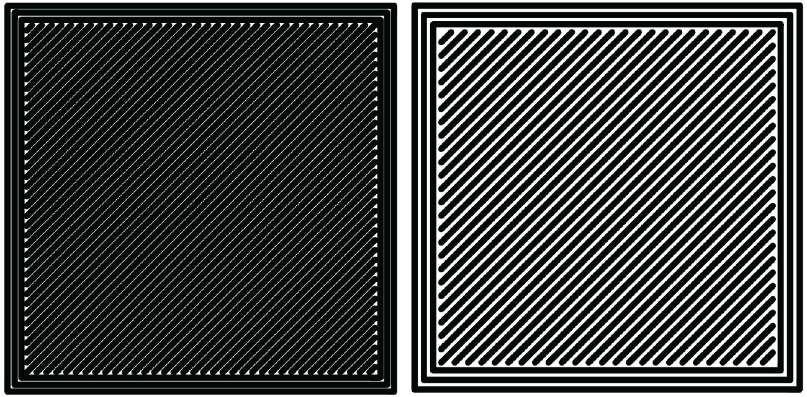

.. Sphinx RTD theme demo documentation master file, created by
   sphinx-quickstart on Sun Nov  3 11:56:36 2013.
   You can adapt this file completely to your liking, but it should at least
   contain the root `toctree` directive.

=================================================
Cura for Robo
=================================================
To get your 3d prints out looking great, Cura for Robo Desktop Software is the recommended software. This software takes your 3d models, and turns them into a language that the Robo C2 can read, and uses it to produce an object. 

For the Quick Start Guide on using Cura for Robo, click this link (https://www.robo3d.com)

Get Started
-----------

To Download Cura for Robo, click this [link](https://www.robo3d.com)

**Requirements**

 1. Operating Systems
  * Windows Vista or higher, 64 Bit
  * For Mac instructions, follow this link (https://www.robo3d.com)
  
 2. Hardware
  * OpenGL 2 compatible graphics chip
  * Intel Core 2 or AMD Athlon 64 or newer 

**Installing and Setup**

 1. Starting Cura for Robo for the first time
  * After installing Cura for Robo, go ahead and open the application from your applications folder (or wherever you have installed it).
 
 2. Selecting a printer
  * The first time you open Cura for Robo, you will see a Add Printer Wizard window. Here is where you will select which printer you have by selecting either the Robo C2 or the Robo R2. Once selected, click the 'Add Printer' Button and your profile will be saved with the correct settings for your printer for optimal printing.

.. image:: images/Add-Printer.PNG
   :alt: Add Printer Wizard
   :align: center

**Overview**

This is the main view of Cura for Robo. You can reference back to it if you ever need a quick refresh of where things are located within the software.

.. image:: images/Interface2.jpg
   :alt: Interface
   :align: center
   
1. Loading a model
 * Click on the 'Open File' icon at the top left of the screen. Find your .stl file you would like to load and open it. Once this is done, the model should appear on the build platform in the main viewer. 
 
.. image:: images/Load-File.png
   :alt: Load File
   :align: center 
  
 * Note; you can also simply drag and drop an .stl file directly on the main viewer to load it onto the build platform
  
2. Selecting Material
 * Once your model is loaded, the next option you will need to select is your material. Make sure the material you select is the same one that is loaded into your printer. 
 
3. Selecting a Profile
 * Next, click on the dropdown menu marked 'Profile'
 * Here, you will see different profile settings that will determine the quality of your print. 
 * Select the profile desired - Low, Medium, High, Ultra High Quality. 
  
.. image:: images/Profile-Settings.png
   :alt: Profile Settings
   :align: center   
 
* Below the Pofile settings, you will find the simple recommended print settings. Here you can change infill density, as well as using print build plate adhesion for better adherance on your first layer, and support structure for generating scaffolding to support overhangs and bridges. 
 
.. image:: images/Recommend.JPG
   :alt: Recommended Settings
   :align: center  
 
 4. Saving a File
  * In the bottom right corner of the main window, you will see a 'Save to File' button. Once your satisfied with your model and settings, go ahead and save your file. Note: if you have a USB flash drive inserted, you can save directly to the drive with the same button.
  
.. image:: images/Print.JPG
   :alt: Save File
   :align: center 
  
Configure and View the Model
-----------

**Configuring the Model**

To further configure your model for printing after you have loaded it onto the build platform, click on the model so it becomes highlighted.

1. Move
 * You can move your model around the build platform with the Move tool. Either by the 'click-and-drag' method, clicking the arrows projecting from the model, or entering values in the fields provided.

.. image:: images/Configure.JPG
   :alt: Configure Model
   :align: center  

2. Scale
 * Selecting the Scale tool will allow you to scale the model in 3 different ways
 * Dragging the handles located on the model itself will scale the model in whichever way the handle is oriented
 * Entering the size desired into the number field scales the model into an exact dimension desired
 * Selecting a percentage to scale will allow you to scale the model by a certain percentage based on its original dimensions
 * Note; if you want your model to come out uniform, select the 'Uniform Scaling' check box when scaling
 
.. image:: images/scale.png
   :alt: Scale Model
   :align: center
 
3. Rotate
 * Selecting the rotate tool will bring up different ways to rotate your model
 * You will notice colored rings around your model for different axis. Click and drag one of these rings to rotate in that direction
 * Also shown is the 'Reset' and 'Lay Flat' buttons to orient you model in a way that best suites you
 
.. image:: images/rotate.png
   :alt: Rotate Model
   :align: center

4. Mirror
 * The Mirror tool will allow you to mirror the model in the X, Y, and Z axis. 
 * Simply click on one of the arrowheads that pop up on your model to mirror it in that direction.

**Viewing the Model**

Once you have satisfied all of your configuration and profile settings, you can view the model in layer mode. Layer mode allows you to inspect the way your model is sliced and will be printed. It is usually best to inspect your model this way to see if it will be printed the way you are intending.

.. image:: images/View-mode.png
   :alt: View Mode
   :align: center

1. Solid
 * Solid view is the deafualt view when the program is started. You can view the digital model to see if it is created like it was intended, and also see where it might have imperfections when examining it. 
 * The model will be colored yellow if it is selected and within the usable print area, and grey if it is either deselected or out of the printable build area.
 
2. X-Ray
 * With X-Ray view, your model will show gaps and intersections throughout your model. These will be shown in red. 
 * If an error is located in your model, go ahead and adjust it in your 3d design software and reload the model to check if the error has been fixed.

3. Layers
 * Layers view is one of the more important views to check before you start printing your model. The Layers view is a virtual representation of the where your nozzle is going to move throughout the print process of the physical model.
 * When the Layers view is selected, a slider will appear beneath the button.
 * Use the slider to look through your layers one by one and see how your model will be built.
 * You can also input a layer number to jump directly to the specified layer of your model.
 * Note: Every time a setting is changed, the view has to be completely reloaded with the new settings in layer view.
 
.. image:: images/layer-view.png
   :alt: View Mode
   :align: center

Settings
-----------
Settings profiles are provided to you as defaults, but depending on the specific model or personal preference, you can modify your settings by clicking on 'Custom' under Print Setup on the left hand side of the main window. Below are what the different settings change. 

**Quality**

1. Layer Height

 The layer height of your model will ultimately determine how detailed your print will visibly look. Layer height refers to the thickness of a single printed layer. The smaller the layer height, the more detailed your model will look, but will take longer to print. The larger the layer height, the less detailed your model will look, but will take less time to complete compared to lower layer heights. 
 
.. image:: images/layer-height.png
   :alt: Layer Height Comparison
   :align: center

2. Initial Layer Height

 Initial layer height determines the first layer height of your print. More often than not, the initial layer height is thicker than the remaining layers to create a stronger bond to the build platform by laying down a bit more plastic onto it. This helps the print not come loose from the bed when printing the rest of the model. If you have a raft (build plat adhesion option) enabled, your initial layer height can be the same as your layer height. If you do not have a raft enabled, it is best to use a thicker initial layer height.

3. Line Width

 Line Width determines the width of a sinle printed line. Normally, the line width should equal the diameter of your nozzle for most prints. Cura for Robo will automatically calculate how much plastic should flow out of the nozzle based on line width. 
 

Left: smaller line width - Right: larger line width

**Shell**

1. Wall Thickness

 Wall thickness determines how many walls (or perimeters) your print will have. Set this value to be a multiple of line width from the section above. The larger your wall thickness, the sturdier your print will be, but the more time it will take to print. An average wall thickness is about 3 times your line width.

.. image:: images/wall-thickness.png
   :alt: Wall Thickness Comparison
   :align: center
Left: 3 walls - Right: One wall

2. Wall Line Count

 You can also set a wall line count if you do not want to set your wall thickness. The wall thickness will be automatically calculated if you enter a wall line count number into this field based on your line width.

3. Top/bottom thickness

 The top/bottom thickness setting will determine how many solid layers of plastic you will print on the top and bottom of your print. The higher the thickness count is, the less gaps you will see in the top and bottom layers, but will increase print time and use a bit more filament. When setting this value, set it as a multiple of your layer height to ensure even distribution of plastic. For thicker layer heights (.2 mm), .6 or .8 mm thickness should be sufficient. For thinner layer heights (.1 mm), use .8 or 1 mm thickness to get a clean top and bottom layer.

4. Top or Bottom thickness

 Here you can set different thickness for both the top and bottom of your print independently. In general, bottom thickness does not need to be set as high as the top layers because you are printing onto a flat surface. For the top layers, it is better to have more layers to fill in all voids in the print sufficiently.

5. Number of Top/Bottom layers

 Instead of setting the thickness of your top and bottom layers, you can adjust the specific number of layers if you wish. When you do this, the top/bottom thickness will be automatically calculated to match the layers input.

6. Top/bottom pattern

 You are able to change the pattern of your top and bottom layers. There are 3 options; concentric, lines, and zig zag. Concentric fills in your layers with the same pattern from the outside in. Lines and zig zag both fill in your layers with a diagonal patern, either connecting to the shell or moving around the shell to infill the layers.

.. image:: images/bottom-pattern.png
   :alt: Pattern Comparison
   :align: center
Left: lines pattern - Right: concentric pattern

7. Z seam alignment

 On most prints, the is a visible seam that appears on a model from when your printers' nozzle pauses to change layers in the z direction. Z seam alignment allows you to place where each new layer in the z direction starts, producing where the seam will be. There are 3 options to choose from; shortest, back, random.
 
 * Shortest will use the z seam wherever the last layer left off and will start the new one right away, producing a shorter print time, but a visible seam. 
 * Back will simply put all layer changes at the back of the model, so make sure to rotate the model towards the back of the build plate where you dont want the seam to show up. 
 * Random will choose a different spot to put the seam, which will eliminate visibility, but increase print time. 

**Infill**

1. Infill density

 The infill density determines how dense your print will be by filling in your print with plastic by a certain percentage. 100% infill density means your print will be totally filled in with plastic, while 0% infill density means your print will only print the perimeters with no plastic filling in the middle. More infill produces a sturdier print, but takes more time, whereas less infill produces a weaker print, and takes less time to print. An average infill density is around 20% for visual models, whereas higher infil density parts are used more for structural or mechanical use models.
 
.. image:: images/infill-density.png
   :alt: Infill Density Comparison
   :align: center

2. Infill pattern

 Infill pattern will vary depending on what you are looking for in your use of your model. There are 7 options;

 * Grid: A grid shaped infill, with lines in both diagonal directions on each layer.
 * Lines: Creates a grid shiped infill, printing in one diagonal direction per layer.
 * Triangles: Creates a triangular shaped infill pattern.
 * Cubic: A 3D infill of tilted cubes.
 * Tetrahedral: A 3D infill of pyramid shapes.
 * Concentric: The infill prints from the outside towards the center of the model. This way infill lines won’t be visible through the walls of the print.
 * Zig Zag: A grid shaped infill, printing continuously in one diagonal direction.

 (insert picture of different infills)

3. Infill layer thickness

 Infill layer thickness determines how thick your infil layers are. Because you do not see the infill of a print, you can choose to make these layers less detailed and drastically reduce print time. If this setting is used, make sure the thickness is a multiple of the layer height (i.e. .1 layer height, .2 infill layer thickness). This will allow your printer to print two layers and then go back in and fill in the inside of the print, essentially printing the equivalent of tow infill layers at a time.

4. Infill before walls

 If infill before walls is enabled, the layer being printed will fill in the infil before the perimeters. Printing the infill first leads to sturdier walls, but the infill pattern might sometimes show through the surface. Printing the walls first may lead to more accurate walls, but overhangs may print worse.

**Material**

1. Printing temperature

 Printing temperature determines the heat of the nozzle while printing. Most filaments print between 175°C and 250°C, although some can print lower or higher than this. For PLA, a temperature of 190°C is optimal for Robo branded filaments, while ABS has an optimal printing temperature of 230°C.

2. Build plate temperature

 Build plate temperature determines how hot your heated build platform will get in order to adhere the plastic down to it. The Robo C2 does not have a heated build platform, while the Robo R2 does. For the Robo R2, PLA is best printed with a 60°C build platform, and ABS plastic at 90°C for best stick on the first layer.

3. Enable Retraction

 Retraction is used when the printer is traveling from one point to another without laying down any plastic. During this time, there can be melted plastic in the nozzle, which could ooze out and cause unwanted plastic on your models. In order to elimiate this ooze, enable retraction to retract, or pull back the filament while on these travel moves. Different material require different settings for best results. Contact your material manufacturer for best retraction settings.

4. Retraction distance

 Retraction distance determines how far the material, in millimeters, will get pulled out of the nozzle when performing a retraction move. A short retraction distance will result in less potential damage to your material, such as snapping or clogging, but will cause more oozing. A long retraction distance will result in more potential damage to your material, but will have less oozing and a nicer print finish.

5. Retraction speed

 Retraction speed determines how fast or slow the motor pulling the material up will turn. A fast retraction speed will result in a larger potential damage to your material and drive gear, but will have less oozing. A slow retraction will have less potential damage, but result in potentially more oozing.

6. Retraction minimum travel

 This determines how far your nozzle must travel in order to execute a retraction move. If your model has a lot of small areas, this will cause the printer to retract a lot, and will be more prone to clogs and potential errors. To decrease the chance of errors on a lot of retraction moves in a small area, increase the retraction minimum travel. Be mindful that increasing this setting too much can result in stringing and unwanted artifact on your printed part due to oozing.

**Speed**

1. Print speed

 Print Speed determines the speed of the print head while printing (in mm/sec). Printing faster will get your print done faster, but also risk the print job failing too to motors failing or material not being extruded properly or heated optimally. The profiles set for the C2 and R2 are best used to keep the machine lasting longer, at the same time as printing quickly.

2. Infill speed

 This setting changes the speed in which your infill is printed. Note that because the infill of a print is not seen, you can increase this speed if you would like. Be mindful that a faster infill speed can potentially affect the strength of your print.

3. Outer wall speed

 The speed of the outer wall, or outer perimeter. Printing the outer wall slower than the inner walls and infill will result in a better surface finish of your printed model

4. Inner wall speed

 The speed of the inner walls, or inner perimeters. Because this does not affect the surface quality of your printed model, this speed can be as fast as your infill or print speed setting.

5. Top/bottom speed

 Top/bottom speed determines how fast your solid top and bottom layers are printed. Note that the slower bottom layers give you more reliability of the model by giving it a dependable base, and slower top layers give you a more reliable roof on your print to give it a nice surface and close off all gaps.

6. Travel speed

 Travel speed determines how fast your print head will move when it is not extruding material and printing your model. This move can be higher than your print speed to make printing time lower, but be mindful of moving too fast and motors or belts failing.

7. Initial layer speed

 The speed for the first layer. A lower value is used here to improve adhesion to the build platform and get a reliable first layer down.

8. Initial layer travel speed

 The travel speed for the first layer. A lower value is used here to ensure that the print nozzle does not potentially touch existing plastic laid down on the build platform and pull it up, resulting in a failed print.

9. Number of slower layers

 The number of slower layers determines how many layers from the beginning of the print are going to be slower than the rest. The overall success rate of a print is relying on the first layers adhering to the bed correctly. The speed of your print is gradually increased over these layers.

**Travel**

1. Combing mode

 Combing mode keeps the print nozzle within the interior of the model whil traveling from one point to another. This reduces the number of retraction moves because the extruder wont retract if enabled, but will increase print time. If combing mode is off, the print nozzle will travel the shortest distance from where it stopped to the next point it needs to go, not minding what is in its path underneath it.

 (insert combing pic here)

2. Avoid printed parts when traveling

 Avoid printed parts when traveling will move the nozzle around printed parts to make potential oozing mot get hit by the printed part. Sometime this can lead to the nozzle hitting an existing printed part and knocking it over as well. Enabling this will increase the surface quality of your printed part.

3. Travel avoid distance

 Travel avoid distance determines how far a distance your print nozzle will will be from your existing printed parts when 'avoid printed parts when traveling' is enabled. The farther this distance is away, the less chance you have at running into a part with your nozzle, but will increase printing time of your model.

4. Z-hop when retracted

  When z-hop when retracted is enabled, the build platform of your printer will drop by a certain height. The reason for this is to prevent your nozzle from hitting already printed parts on your build platform, as well as eliminates unwanted extra plastic on your parts due to oozing or stringing. 

5. Z-hop height

 The z-hop height determines how far down your build platform will lower every time there is a retraction. The larger the height, the safer it is, but the longer your print will take.

**Cooling**

1. Enable print cooling

 Cooling fans are essential when printing with certain materials. Print cooling will make sure that the previous layer of material that is extruded is cooled enough so that the next layer can be printed on top of it with a solid base beneath it. Cooling also is needed for overhangs and will dramatically increase the surface quality of prints. For some materials (like ABS plastics), 

2. Fan speed

 Different materials require different fan speeds to optimize print quality. Some materials can shrink more than others when cooled faster, while some dont need fans at all. 

3. Regular/maximum fan speed threshold

 * Regular fan speed is the speed when the printer is doing most of the work.
 * Maximum fan speed is the speed when your printer is spending a minimal time on a layer and needs to cool down the plastic very quickly to make sure it is hardened before moving to the next layer up.

4. Regular fan speed at height

 The regular fan speed at height value determines at which layer the fans will turn on. Because the Robo C2 and Robo R2 are suggested to use rafts, we determined this value to be higher than obvious due to the fact that fans can cool the bottom layers too well, and cause warping of your print and ultimately delaminate the plastic from the bed.

5. Minimum layer time

 The minimum layer time determines how long the printer should take to at least print a single layer. If the actual print time of a single layer is below this value, the printer will slow down so the minimum layer time is reached, allowing the plastic to cool properly before the next layer is printed on top of it.

6. Minimum speed

 The minimum speed determines the lower threshold of how slow the printer will actually print regardless of minimum layer time. This will make sure that the printer is not too slow, causing extrusion and motor issues, and degrading the sureface finish of the printed model.

**Support**

1. Enable support

 Enabling support will give your model a scaffolding underneath parts of the model that may need some support underneath their overhangs. Overhangs are part of your model where the plastic is being laid down in mid air. Instead of the model being printed onto air, the support structure will be able to assist the overhangs to be held up when being laid down.

2. Placement

 Placement determines where the support structure is placed. There are two options to choose from:
 
 * Touching Buildplate: The support structure is only printed on overhangs that are directly over the build platform.
 * Everywhere: The support structure is printed everywhere there is an overhang, even if it is somewhere inside or on the model itself.
 
 (insert pic here)

3. Overhang angle

 The overhang angle determines the angle at which support material will be used. The larger the angle, the less support material is used. If set at 90°, there will be no support material, whereas a 0° angle will use supports everywhere on the model.

(insert pic here)

4. Support pattern

 Support pattern determines the ease of removal and sturdiness of the support structure. There are five patterns to choose from:
 
 (insert pic of different support structures here)
 
5. Support density

 The density of your support will result in different strength of your support structure. A lower density will be easier to remove, but not as strong compared to a higher density, which will be harder to remove from the finished print, but give you a stronger support structure.

6. X/Y distance

  X/Y distance determines the distance between the support structure and the model itself in the x and y directions. A bigger value increases the distance, which will make the support structure less likely to touch the model and fuse the support to the model. Be aware that as the value increases, the more likely a small overhand in the x or y direction would not be supported because the distance is further away.
  
  (insert pic here)

7. Z distance

 Z distance determines the space between the top and bottom of the model and the support structure. Top distance determines the distance between the top of the support structure and the bottom surface of the overhang. Likewise, the bottom distance determines the distance between the bottom of the support structure and the top area of the model. This value should always be small, but depending on the model, might need to be tweaked higher and lower. A smaller value will result in a cleaner surface finish of the model, but will be harder to remove from the model. A higher value will be easier to remove, but will result in a more rough surface finish on the model.
 
 (insert pic here)

8. Horizontal expansion

 Horizontal expansion determines how much the support structure will be printed beyond the model in the x and y direction. A higher value will result in a stronger support structure, but small areas where there are support structure may be harder to remove. A lower value will result in less support structure, which may be hard to remove on areas where there is a lot of support needed to remove after the print is finished.
 
 (insert pic here)

9. Enable support roof

 If a support roof is enabled, the support structure will create a solid layer of plastic at the top of the support structure. When using a support roof, the model will come out with a very clean surface finish, but may be very hard to remove compared to disabling the support roof. 

**Platform Adhesion**

1. Brim

 Using a brim adds a single layer around your object, fused to the outline of your model to improve adhesion to the bed and prevent warping. A brim is very useful for models that have very small surface area as the first layer as the brim prevents those small surfaces from curling up.
 
 (insert pic here)

2. Raft

 A raft is the best method for using platform adhesion on a Robo C2. A raft is a couple layers of plastic that will adhere to both the bed platform and the print itself. If the model has very small surface area, a raft is also the best option for platform adhesion. A raft is comprised of three main parts: Base layer, middle layer, and top layers. 
 
 * Base layer: This is the first layer of plastic put down and should have a larger layer width, looking almost smushed, to help adherance to the bed.
 * Middle layer: Layers that are between the base and top layers. The middle layer gives more surface area for the top layer of the raft to lay down upon. Normally, there is only one middle layer.
 * Top layers: The top layers are the layers which adhere the model to be printed to the raft iself. Top layers work best when printed with 100% fill and two or more are printed to give it a nice clean surface area for the model to be printed onto.

 (insert pic here)

 * Raft air gap: This creates a gap from the top layer of the raft to the actual print in order to remove the raft after printing is finished. A higher value will result in an easier removal of the raft from the print, but can make it harder for the first layer of the print to lay down correctly. Likewise, a smaller value will lay down the first layer well, but can result in a harder to remove raft from the model due to fusing of the plastics.
 
 (insert pic here)
 
3. Skirt

 A skirt is a line printed around the model, but is not fused to the model directly. The skirt acts as a priming line to help make sure the material is flowing out of the nozzle properly before beginning to print the model. 
 
 (insert pic here)

Connecting a Printer via Wifi
-----------

 There is a way to connect Robo C2 directly to Cura for Robo enabling you to print right from within the software. Take these steps to connect your printer;
 
 1. Click on the Robo C2 icon in the top right of the interface.
 
 2. Under the 'Printer' dropdown menu, select 'Manage Printers'.
 
 3. A 'Printers' window will pop up. In the middle right of this pop up window, click on the button labeled 'Connect Octoprint'.
 
 4. A new window labeled 'Connect Octoprint' will pop up. In the top middle of this window, click on the button labeled 'Refresh'. This will bring up all of the printers that are connected to the same wifi network that your computer is connected to.
 
 5. Once you see your printer name populated in the list of printers, select it. Next, select the button labeled 'open webpage' located in the middle right of the window. This will then open your browser and direct you to the printers web interface. 
 
 6. Once you are in the web interface you will see a webpage that looks like this.
 
 7. Click on the 'settings' button in the top right corner of the window. 
 
 8. A settings window will pop up. On the left hand side, scroll down and select the item labaled 'API' under 'Features'.
 
 9. An API key will be present just above a QR code. It is usually a long string of numbers and letters. Go ahead and highlight this number and copy it by pressing ctl+C on windows or command+C on a mac.
 
 10. Next, go back into Cura for Robo desktop application. Paste this API key into the field provided by pressing ctl+V on windows or command+V on a mac. 
 
 11. Finally, click on the 'Connect' button then press 'close'.
 
 12. Congratulations! You can now not only monitor your printer from within Cura for Robo, but you can also send your print jobs directly to the printer with a single click!
 
