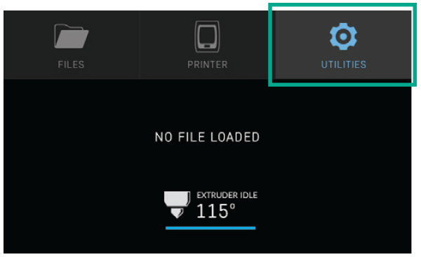
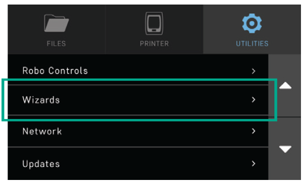

.. Sphinx RTD theme demo documentation master file, created by
   sphinx-quickstart on Sun Nov  3 11:56:36 2013.
   You can adapt this file completely to your liking, but it should at least
   contain the root `toctree` directive.

=================================================
Getting Started
=================================================

.. image:: images/C2-Getting-Started.png
   :alt: Getting Started with Robo C2
   :align: center

What’s in the box
---------------

During your unboxing experience, you will find the following in the box of your Robo C2:

   1. Quick Start Guide
   2. Autodesk Fusion 360 design software free 1-year voucher
   3. 9 print bed tape covers (with 1 already applied to your print bed).
   4. Robo stickers to place EVERYWHERE.
   5. 19V power supply
   6. Filament Guide Tube
   7. 2 filament spool arms
   8. Toolbox with the hotend cover, 2 allen wrenches, lubricant, screwdriver.
   9. Robo USB drive
   10. 500g Robo light blue filament
   11. Spatula
   
.. image:: images/Whats-Inside-the-Box.png
   :alt: Whats Inside the Box
   :align: center

Unboxing Robo C2
---------------

Now that you've received your Robo C2, it's time to unbox it and get familiar with your printer and accessories.

Your C2 is housed in 3 styrofoam pieces, secured together by a nylon strap. Simply lift the printer from the box using the strap and set it down.

(insert gif of taking out of box)

Unclip the black nylon strap and remove the two halves of the top styrofoam shell. Finally, using the handholds on the bottom of your C2, lift the printer out of the bottom styrofoam piece.

(insert gif of unstrapping, taking off foam and removing printer from foam)

.. tip:: Save your printer box, nylon strap, foam inserts, and inclusions box for transportation. Also, you might need the original packaging to exercise your warranty or ship your printer in the future.

The printer's accessories are stored in the inclusions box inside the printer. Simply slide the inclusion box out and be sure to remove the foam.

(insert gif of taking out the insides)

Now we are ready to take off the additional shipping material and zip ties. There are 4 orange rod holders that need to be taken off. Simply push on the clip and it will come off. There is one at each corner of the top gantry

(gif of this)

Next, remove the zipties securing the rods to their plastic brackets

(picture of this)

Register your Robo C2
---------------
Before you start, please register your Robo C2 for any servicing or warranty needs if they’re ever required. You can register your product by visiting robo3d.com/register.

Initial set-up
---------------
Now let’s move forward with your initial set-up of Robo C2.

First, insert the spool holder into the rear slot of the printer.

(insert gif of inserting filament spool)

Next, insert the filament feed tube into the filament sensor block, and then insert it into the extruder.

(gif of filament tube being inerted)

Inside the toolbox you will find the hotend cover. Go ahead and take that out and place it over the hotend. It is held in with magnets so it just pops right in.

(gif of doing this)

From here you’ll want to connect the power cord to the designated area on the back of the printer and then plug it into an AC outlet.

(gif of power cord inserting)

Now go ahead and turn on the printer.

(gif of flipping power switch)

Loading filament
---------------

To begin loading filament, hang your filament spool on the spool holder.

.. image:: images/2.1.png
   :alt: Hang Filament Spool on Spool Holder
   :align: center

Be sure to unroll at least 11”— or 30 centimeters — of filament and thread it through the base of the filament sensor block and into the filament feed tube.

.. image:: images/2.2.png
   :alt: Thread Filament into Filament Sensor Tube
   :align: center

Continue feeding the filament through the filament feed tube until it reaches the extruder. Then, press the extruder button and feed the filament into the printer’s gears.

.. image:: images/2.3.png
   :alt: Feed Filament Until it Reaches the Extruder
   :align: center

Now select UTILITIES on the touch screen.

Then select WIZARDS from the list.

Finally, select FILAMENT LOADING WIZARD.

.. image:: images/2.6.png
   :alt: Select Filament Loading Wizard
   :align: center

And then follow the on-screen prompts, which will include:

- Heating up the printer
- Ensuring you’ve cut off the tip of the filament
- Having the filament feed through until you see it coming from the nozzle
- Pressing NEXT, and
- Pressing FINISHED

Calibration and setting Z offset
---------------

Next you’ll want to calibrate Robo C2 by selecting UTILITIES on the touch screen, and then select WIZARDS from the list.

.. image:: images/3.1.png
   :alt: Select Utilities on Touch Screen
   :align: center

.. image:: images/3.2.png
   :alt: Select Wizards from List
   :align: center

From here you’ll select Z OFFSET WIZARD.

.. image:: images/3.3.png
   :alt: Select Z Offset Wizard
   :align: center

And then follow the on-screen prompts, which include:

- Waiting for the printer to calibrate its home position
- Pressing up and down on the [insert descriptor] buttons while sliding a piece of paper between the nozzle and the print bed until you feel some resistance against the paper
- Pressing FINISHED

Note that you will see the offset progress and completion on the touchscreen.

The test print
---------------

To create your first test print Select FILES on the home screen. Then select a file to print from the list.

.. image:: images/4.1.png
   :alt: Select Files on Home Screen
   :align: center

Now, select START to print—and be sure to wait several seconds while Robo C2 prepares to print the file.

.. image:: images/4.2.png
   :alt: Select Start
   :align: center

The file will start printing.

.. image:: images/4.3.png
   :alt: File Printing
   :align: center

Just note that you can select PAUSE to pause your print, or you can select CANCEL to cancel your print.

.. image:: images/4.4.png
   :alt: Pause and Cancel Options
   :align: center

Removing the test print
---------------

When the test print is complete and cooled down, remove the print bed with the finished print still in place by lifting the bed up and away from the magnets.

Slowly slide the print bed out of the machine with both hands.

Now, carefully flex the print bed from several positions to help loosen the print from the print bed.

Repeat this process until the most of the print is loose from the bed.

Carefully remove the print from the print bed with your hand.

Note that if the print is not coming loose after flexing the print bed, put the bed back in Robo C2 and use the provided spatula to carefully remove the print at its borders. Then slowly work your way underneath the print until it’s loose. Don’t force the print loose by pulling it up directly up from the print bed, since this may cause your print to break.

Connecting to Wi-Fi
---------------

We highly recommend connecting Robo C2 to your Wi-Fi network. Doing so provides you with necessary updates that allows for a more enjoyable 3D printing experience.

.. note:: You can also use the provided Ethernet cable (LAN) to connect Robo C2 directly to your Wi-Fi network.

To begin connecting to your Wi-Fi network, Select UTILITIES on home screen.

.. image:: images/5.1.png
   :alt: Select Utilities on Home Screen
   :align: center

Select NETWORK.

.. image:: images/5.2.png
   :alt: Select Network on Home Screen
   :align: center

Select CONFIGURE WIFI.

.. image:: images/5.3.png
   :alt: Select Configure Wi-Fi on Home Screen
   :align: center

Then select your Wi-Fi network and use the on-screen keyboard to enter your password.

.. image:: images/5.4.png
   :alt: Select Wi-Fi Network
   :align: center

Once you’re done, select CONNECT.

.. image:: images/5.5.png
   :alt: Select Connect
   :align: center

Using Hotspot Mode
---------------

Your printer is capable of starting If no Wi-Fi signals are available for connection, you can use Hotspot Mode to emit a Wi-Fi signal from Robo C2 in order to connect to it wirelessly from your smart device. To access Hotspot Mode, do the following:

   1. Select “Utilities” on the home screen of the Robo C2 touch screen
   2. Select “Network” from the list
   3. Select “Start Hotspot Mode” from the list
   4. Select
