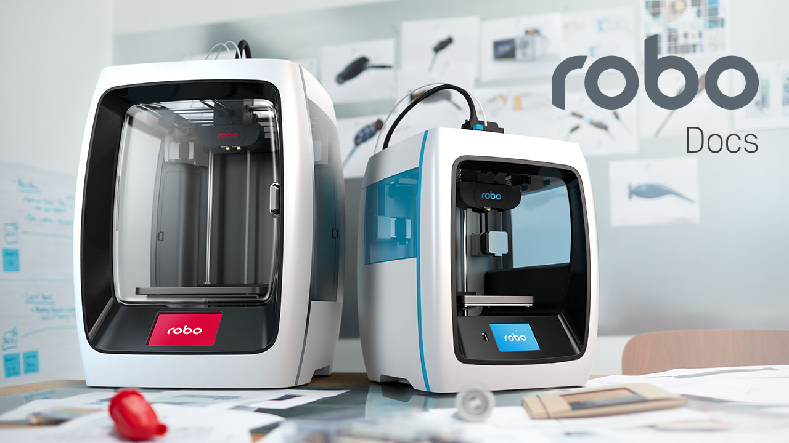

.. Sphinx RTD theme demo documentation master file, created by
   sphinx-quickstart on Sun Nov  3 11:56:36 2013.
   You can adapt this file completely to your liking, but it should at least
   contain the root `toctree` directive.

Enter the Robolution
=================================================

Greetings, Maker!

Thank you for your purchase and welcome to the Robo family! You've found the online manual for all Robo products, from hardware to software.  In here you will find just above everything not covered in the Quick Start Guide you've recieved with your machine. The printer pages are broken up into 4 sections: Getting Started, Operation, Maintenance and Troubleshooting.

In our Maintenance and Troubleshooting sections we've provide useful tips on keeping your printer in top shape, and quickly resolving common issues.  If you have any suggestions on material that should be covered or have suggestions in general, we welcome you to open an issue in Github here: https://github.com/Robo3D/support.robo3d.com/issues

Happy Printing,

Coby Kabili and Braydon Moreno, Robo Co-founders

Make smarter with the Robo app
=================================================

Simply download the free Robo app to experience the next level in 3D printing and get more out of everything you make.

   * Connect and print right from your mobile device
   * Monitor the progress of every print
   * Manage multiple prints and printers at once
   * Manual control panel lets you handle every detail with precision
   * Connect to cloud libraries and access thousands of 3D models
   * Make in-app purchases (filaments, accessories, print kits and more)

Logging into your Robo account
=================================================

To enjoy the best possible Robo app experience, be sure to log into your Robo account. Logging into your account lets you do things like browse models from your cloud storage, and even post status updates via social media to show off all the cool stuff you’re making with Robo C2.

Use the following steps to log into your Robo account:

1. Open the Robo app open and select “Menu” in the upper left corner
2. Select “Log In” on the right hand side of the screen
3. Follow the prompt to successfully login to your account

.. toctree::
   :maxdepth: 2

   R1Plus/index.rst
   C2/index.rst
   R2/index.rst
   cura-for-robo-desktop/index.rst
   web-interface/index.rst
   ios-app/index.rst
   safety-compliance/index.rst
