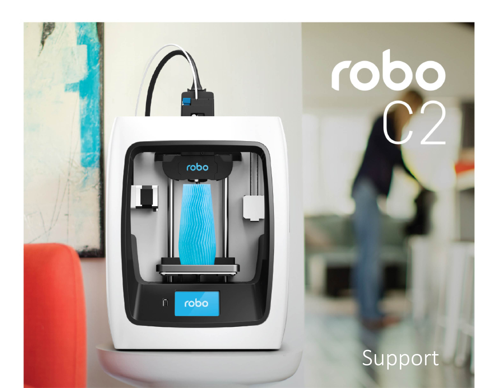

.. Sphinx RTD theme demo documentation master file, created by
   sphinx-quickstart on Sun Nov  3 11:56:36 2013.
   You can adapt this file completely to your liking, but it should at least
   contain the root `toctree` directive.

Enter the Robolution
=================================================

Greetings, Maker!

Thank you for your purchase and welcome to the Robo family! We really love 3D printing and our aim is to get this amazing technology into the hands of as many people as possible to see what awesome creations spring from your imagination.

Here you’ll find all of the information you need for a seamless 3D printing experience with Robo C2. This next-generation 3D printer includes a wish-list set of innovative features required in a modern, connected smart device to make 3D printing fun, easy and accessible to everyone.

To get the most from your Robo C2, please review the full manual.

Happy Printing,

Coby Kabili and Braydon Moreno, Robo Co-founders

Make more with Robo C2
=================================================

The Robo C2 compact smart 3D printer with Wi-Fi gives you the freedom to make whatever you can imagine right from your mobile device using the Robo app.

   * Engineered to fit anywhere in your home or workplace
   * Efficient 5 x 5 x 6 in print size
   * 3.5” built-in color touch screen
   * Class-leading print speed
   * Automatic self-leveling
   * Prints 20+ materials types that don’t require a heat bed

Make smarter with the Robo app
=================================================

Simply download the free Robo app to experience the next level in 3D printing and get more out of everything you make.

   * Connect and print right from your mobile device
   * Monitor the progress of every print
   * Manage multiple prints and printers at once
   * Manual control panel lets you handle every detail with precision
   * Connect to cloud libraries and access thousands of 3D models
   * Make in-app purchases (filaments, accessories, print kits and more)

Logging into your Robo account
=================================================

To enjoy the best possible Robo app experience, be sure to log into your Robo account. Logging into your account lets you do things like browse models from your cloud storage, and even post status updates via social media to show off all the cool stuff you’re making with Robo C2.

Use the following steps to log into your Robo account:

1. Open the Robo app open and select “Menu” in the upper left corner
2. Select “Log In” on the right hand side of the screen
3. Follow the prompt to successfully login to your account

.. toctree::
   :maxdepth: 2

   C2/index.rst
   cura-for-robo-desktop/index.rst
   web-interface/index.rst
   ios-app/index.rst
   safety-compliance/index.rst
