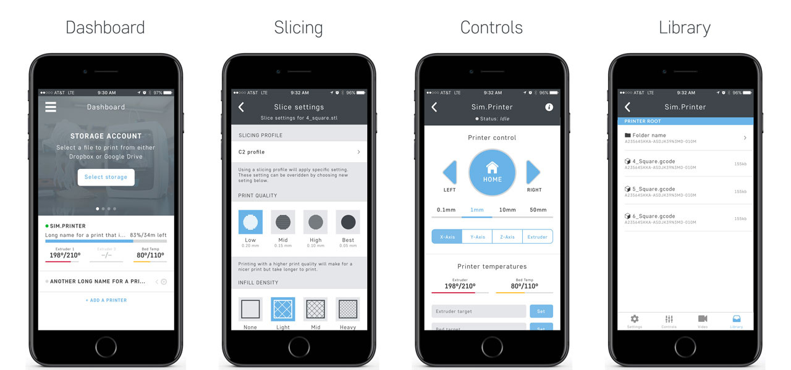
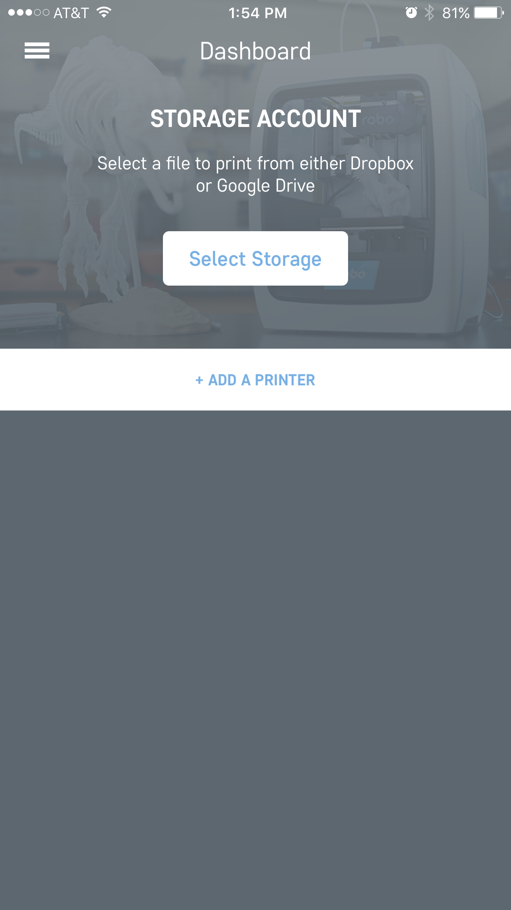
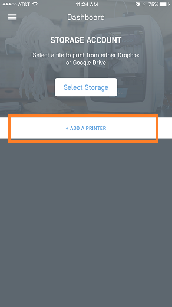
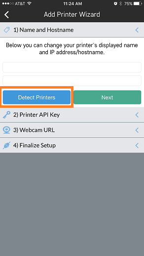
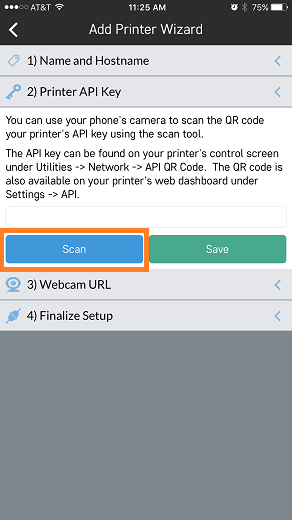
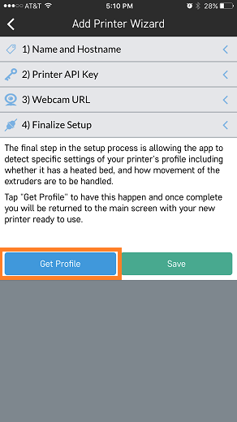
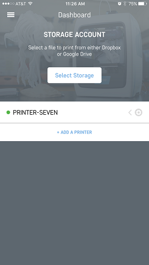
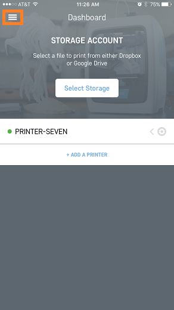
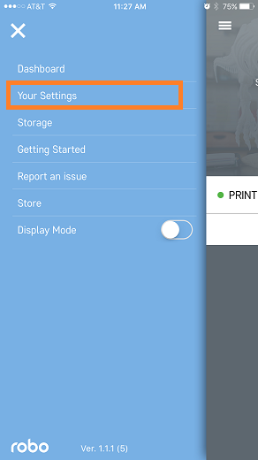
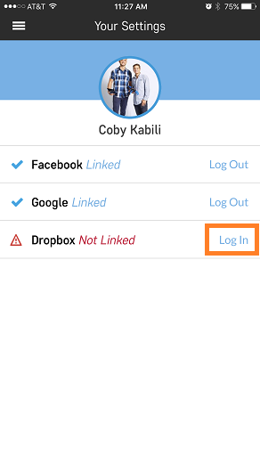

.. Sphinx RTD theme demo documentation master file, created by
   sphinx-quickstart on Sun Nov  3 11:56:36 2013.
   You can adapt this file completely to your liking, but it should at least
   contain the root `toctree` directive.

=================================================
Robo App for iOS
=================================================

.. image:: images/ios-header.jpg
   :alt: iOS Header
   :align: center

Overview
---------------

* Connect to your local Robo C2 or Robo R2 3d printer
* Slice models directly on Robo C2 or Robo R2
* Monitor progress via the dashboard
* View your creation via Robo R2's integrated camera
* Remotely control your Robo C2 and Robo R2 via your iPhone or iPad

Getting Started
---------------

The first time opening the Robo app

Share app data
link facebook or continue as guest
takes you to your dashboard

Adding a Printer
---------------

Once you are in the Robo app, the first screen that will appear is the dashboard. From here you can add a printer that is on the local network.
First, click the 'Add a Printer' button towards the middle of the screen. This will take you through a series of steps to set up the new printer on the Robo app.

Next, follow the steps to add a printer. Scan for local printers that are the network by pressing the scan button. This will bring up a pop up that will show all of the available printers on the local network. Choose your printer and it will add it to the line automatically. You can name the printer as well in the provided text box.

Then, you will want to add the API key that is located on your printer. Press the 'scan' button and it will bring up the camera. Now, you will need to scan the QR code that is located on your printer. Go to your printer and go to Utilities> Network> API Key. Here, an API key will show. Go ahead and scan this API key with your phone and it will get added automatically to that section of the app.

The next section is the video section. If your have a Robo C2, you can skip this part. If you have a Robo R2, go ahead and scan for video. It should find it automatically and add it.

Next, it will ask if you want to set up profiles automatically. If it is a new printer and you want to add profiles that are built for the Robo C2 or Robo R2, go ahead and click the add profiles button. If you would like to manually set up your profiles, you can do that too.

Once these profiles are added, you will be taken to the dashboard screen and you should see your new printer ready to go on the dashboard.

Congratulations, you have now added your printer to remotely monitor it from the Robo app..

Linking Cloud Storage
---------------

Within the Robo app, the ability to link cloud storage makes it easy to access your files from anywhere, without the need for a computer.

From the dashboard view, click on the menu tab in the upper left hand side of the screen. This will open up a menu list. From here, click on 'Your Settings' menu item.

Once in your settings, log into your Dropbox and Google Drive accounts by clicking 'Log In' next to their respective names.

Now, since you are logged into your cloud storage accounts, you can click on 'select storage' from the dashboard and successfully see all the files that are in your cloud stage accounts.

.. image:: images/dashboard-select-storage.png
   :alt: Select Storage
   :align: center

General workflow
---------------

There is an easy workflow to get from file to printing and these are the steps to do it:

1. Make sure you are logged into your Google Drive or Dropbox account.
2. Go to your browser on your iOS device, and find a file on a file sharing site like www.thingiverse.com.
3. While still in the browser, upload that file to your Google Drive or Dropbox account.
4. Next, go into the Robo app.
5. In the dashboard, click on the button labeled 'Select Storage'.
6. Now select the storage where you had uploaded the file to.
7. Once you are in here, find the file that you had uploaded and click on it. This will bring up a pop-up of which printer you would like to send the file to.
8. Select the printer you want to print the file with, and it will go directly into either slicing mode, or a page that will allow you to start the print.

Printer Controls
---------------

and terminal

Slicing a model
---------------

If you have an STL file that is saved in your cloud storage or on the printer itself, you can slice the file and get it ready for printer through the app by using these steps:

1. Go to your library either on your cloud storage or on the library within the printer. Once you click on an stl file you wish to print, you will be taken to a slicing wizard screen.
2. On this slicing wizard screen, you have the choice to change your layer height, infill percentage, temperatures, and printing with supports and rafts.
3. Once you have selected your settings, click the 'Send to Printer' button and choose which printer your would like to send it to.

slice from an stl file or cloud

Video
---------------

view

Library
---------------

If you want to see which files are currently on your printer, first, click on the printer name from the dashboard. Next, in the bottom right, click on the library button to view all of the files on the printer.

viewing your files

Connecting your printer to wifi
---------------

If you want to connect your printer to a wifi network, there are a few steps to take.

1. First, make sure your printer is in hotspot mode. Connect your iOS device to the printers wifi signal.
2. Now, go into the Robo app and go to your dashboard.
3. Look for the printer you would like to connect to a local wifi network.
4. Swipe left on the printer name from the dashboard screen, and click the 'wifi' button that is shown.
5. Follow the on screen instructions to connect your printer to a wifi network.

work flow

Your Settings
---------------

Your Settings is the area of the Robo app where you can log into your Facebook, Google Drive, and Dropbox accounts.
Tap on the 'Menu' button in the top left corner of the dashboard screen. On the left hand side, click on 'Your Settings'.
You will see three accounts you can log into: Facebook, Google Drive, and Dropbox.
If you are logged into Google Drive and Dropbox, you will be able to access your cloud libraries to print directly from the app by downloading these cloud files to your printer.

Store
---------------

Multiple Printers
---------------
