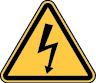
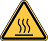
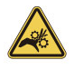
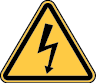

.. Sphinx RTD theme demo documentation master file, created by
   sphinx-quickstart on Sun Nov  3 11:56:36 2013.
   You can adapt this file completely to your liking, but it should at least
   contain the root `toctree` directive.

=================================================
Safety & Compliance
=================================================

Before you begin printing, take a look at the following safety precautions.

Radio and television interference
This equipment has been tested and found to comply with the limits for a Class B digital device, pursuant to Part 15 of the Federal Communications Commission (FCC) rules. These limits are designed to provide reasonable protection against harmful interference in a residential installation. This equipment generates, uses and can radiate radio frequency energy and, if not installed and used in accordance with the instructions, may cause harmful interference to radio communications. However, there is no guarantee that interference will not occur in a particular installation. If this equipment does cause harmful interference to radio or television reception, which can be determined by turning the equipment off and on, the user is encouraged to try to correct the interference by one or more of the following measures:

• Reposition or relocate the receiving antenna.
• Increase the separation between the equipment and the receiver.
• Connect the equipment to an outlet on a circuit different from that to which the receiver is connected.
• Consult the dealer or an experienced radio/TV technician for help.

You may also find the following FCC booklet helpful: “How to Identify and Resolve Radio-TV Interference Problems.” This booklet is available from the U.S. Government Printing Office, Washington, D.C. 20402. Changes and modifications not expressly approved by the manufacturer or registrant of this equipment can void your authority to operate this equipment under FCC rules.

The following indicate potential safety hazards that could harm you or others or cause product or property damage.

+---------+----------------------------------------------------------------------------------------------------------------------------------+
| |logo3| | **Warning - High temperatures: Robo C2 generates high temperatures. Always allow Robo C2 to cool down before you reach inside.** | 
+---------+----------------------------------------------------------------------------------------------------------------------------------+

+---------+------------------------------------------------------------------------------------------------------------------------------------------+
| |logo2| |**Warning - Moving parts: Robo C2 includes moving parts that can cause injury. Never reach inside the Robo C2 while it is in operation.** | 
+---------+------------------------------------------------------------------------------------------------------------------------------------------+

+---------+---------------------------------------------------------------------------------------------------------------------+
| |logo2| | **Warning - Risk of electric shock - There is a risk of shock with Robo C2. This product is not user serviceable.** | 
+---------+---------------------------------------------------------------------------------------------------------------------+

+---------+------------------------------------------------------------------------------------------------------------+
| |logo|  | **Warning - Do not leaving the printer unattended: Do not leave the Robo C2 unattended during operation.** | 
+---------+------------------------------------------------------------------------------------------------------------+

Caution - Do not use incorrect / unapproved printing materials: Do not print using materials that have not been approved by Robo for use with the Robo C2. We highly recommend only using the following when you print:

* PLA filament
* Wood filament
* Carbon fiber filament

+---------+-------------------------------------------------------------------------------------------------------------------------------------+
| |logo|  | **Caution - Use a proper wall socket location: The wall socket outlet must be located near Robo C2 and must be easily accessible.** | 
+---------+-------------------------------------------------------------------------------------------------------------------------------------+

+---------+-----------------------------------------------------------------------------------------------------------------------------------+
| |logo|  | **Caution - Disconnect from wall socket in case of emergency: In case of emergency disconnect the Robo C2 from the wall socket.** | 
+---------+-----------------------------------------------------------------------------------------------------------------------------------+

+---------+---------------------------------------------------------------------------------------------------------------------------------------------------------------------------------------------------------+
| |logo|  | **Caution - Operate Robo C2 in a well-ventilated area: Robo C2 melts plastic during printing. Plastic odors are emitted during this operation. Make sure to set up Robo C2 in a well ventilated area.** | 
+---------+---------------------------------------------------------------------------------------------------------------------------------------------------------------------------------------------------------+

    

    

    

    

    
