.. Sphinx RTD theme demo documentation master file, created by
   sphinx-quickstart on Sun Nov  3 11:56:36 2013.
   You can adapt this file completely to your liking, but it should at least
   contain the root `toctree` directive.

=================================================
Robo Web Dashboard
=================================================

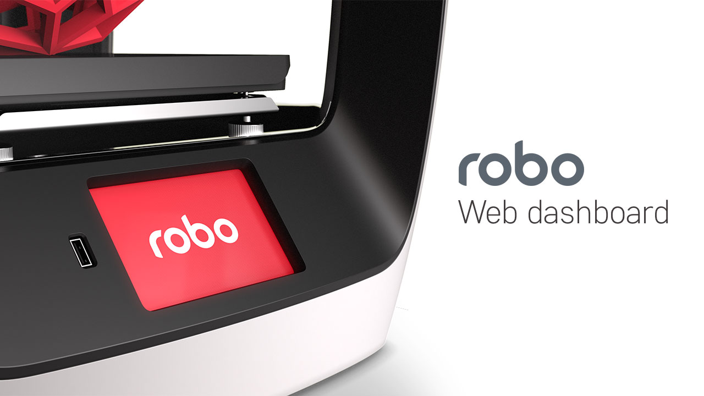

For the Quick Start Guide on using the Robo Web Dashboard, click here: Robo_Web_Dashboard_QSG_.

.. _Robo_Web_Dashboard_QSG: https://www.robo3d.com/web-dashboard

Overview
---------------

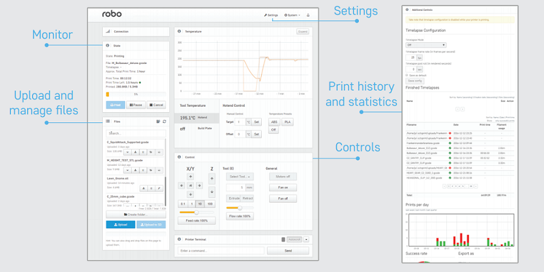

How to connect
---------------

There are three different ways to connect to the web dashboard from your browser:

Note: Make sure your Robo C2 or Robo R2 is connected to the wireless network or in hotspot mode or else you wont be able to connect to your printer in the web browser.

**IP Address**

1. Here we can use the IP address of your printer to login to the web dashboard. On the screen of the Robo C2 or Robo R2, go to Utilities> Network> Network Status. Here you will see an IP address. Copy this IP address down and bring it over to your computer.

2. Open up your web browser (such as Google Chrome or Mozilla Firefox), and enter this IP address into the address bar. If you entered it correctly, you will see a web dashboard come up.

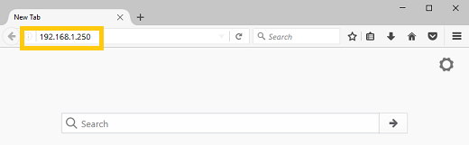

Note: You can also connect via a web browser on a smartphone for on-the-go connectivity

**Printer name via Bonjour**

1. Mac and iOS Users
 * First, locate the printer name. There are three places this is shown; On the back of the printer, on the screen under Utilities> Network> Network Status, and on the bar code sticker that came on original box
 * With this name known, go to your web browser and type the name into the web browser address bar followed by a .local/  (examples below).
 * Example - Printer Name: **plastic-gordon**, you would enter **plastic-gordon.local/** into your web browser address bar.
 * Example - Printer Name: **compassionate-shirley**, you would enter **compassionate-shirley.local/** into your web browser address bar.

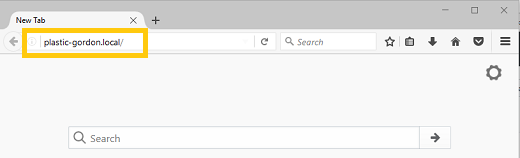

2. Windows and others

 * In order to use bonjour to connect to your printer on a browser via it's name, you will need to install the bonjour extension in order for your computer to recognize names as IP address'. Download here
 * Once installed follow the steps used for Mac and iOS users above.

**Hotspot Mode**

1. To use hotspot mode, select hotspot mode on your printer via Utilities> Network> Start WiFi Hotspot
2. Now look for your IP address under Utilities> Network> Network Status
3. Next, go to your computer and make sure to connect to the printers wifi hotspot.
4. Now, type the IP address into your web browsers web address bar and the dashboard should pop up.

Uploading gcode Files
---------------

If you have already sliced your file via Cura for Robo, or another slicer program, there are two main ways to upload gcode files to your printer. By the 'Upload' button, as well as a 'drag-and-drop' approach.

1. The 'Upload' Button is located where the file list is towards the bottom of the list.

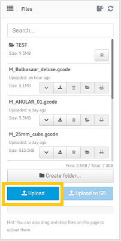

2. You can also simply drag your gcode file from your computer into the dashboard. The dashboard will get dark, and you may then drop the file onto the left side of the dashboard where it says 'upload'

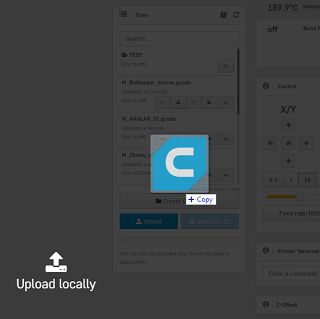

Uploading stl Files
---------------

If you have an stl file that you want to print, you can slice it on your printer directly through the web dashboard. You can grab an stl model from places like www.thingiverse.com, www.myminifactory.com, or upload your own from your 3d modeling software.

Once you have your stl file, go ahead and upload it to your printer by either of the two ways from the section above Uplading gcode Files (link)

Once you upload your stl file to the printer via the web dashboard, a pop up window will show up asking you if you would like to slice the file, and with what settings.

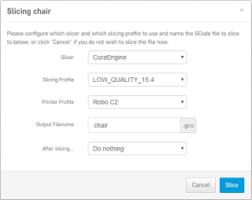

Choose from your print profile settings of Low, Medium, High, or Ultra High - with or without a raft. Once your profile settings have been selected, you can choose to name your file and choose to start printing or do nothing after slicing.

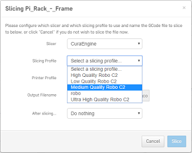

Set temperature and move motors
---------------
1. Under the 'Temperature' section of the web dashboard, you can set temperatures for your nozzle and your bed (Robo R2 only). This is a good place to toggle your temperatures if your material needs more or less heat.

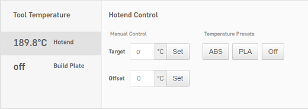

2. Under the 'Control' section of the interface, you can move your motors and extrude filament. Use the arrows and the distance to move ijn the desired location. Remember to heat up your nozzle before using the 'extrude' and 'retract' buttons.

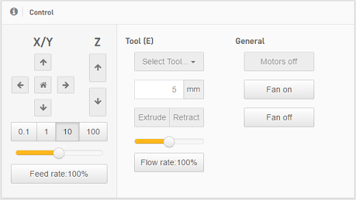

View on-board camera + timelapse (Robo R2 only)
---------------

1. Viewing your print with the camera
 * Under the 'Webcam' section of the web dashboard you will see a live stream of the inside of your Robo R2. Here you can monitor not only your current print project, but also if the printer is clear of any print on the print platform, and if it is ready to start another print.

.. image:: images/webcam2.PNG
   :alt: Webcam
   :align: center

2. Timelapse feature
 * Under 'Additional Controls' you will find 'Timelapse Configuration'. This will allow you to take intermittent snapshots of your print, which will automatically put together in a timelapse video. Here, you can control the settings such as: on/off, timelapse frame rate, and timelapse post roll. Right below this, you will find a list of all the Finished Timelapses on that particular Robo R2.

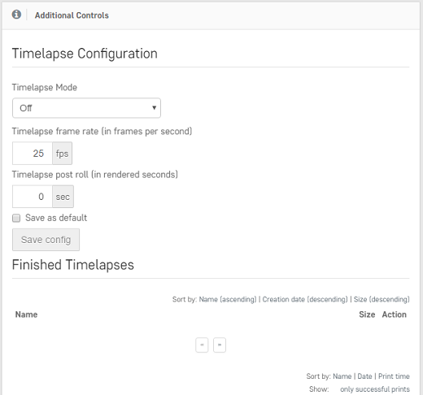

Terminal
---------------

The terminal is where you can see all of the commands being sent to your printer. You can also send specific commands in the terminal to troubleshoot and get feedback on your printer.

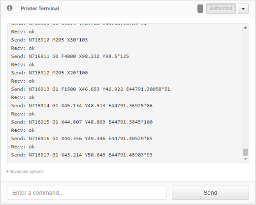

Manage plugins
---------------

Plug-ins are a great way to add functionality to your Robo C2 and Robo R2. There a several plugins that make the entire experience of using your 3d printer easy and accessible. You can manage all of your plug-ins from the web dashboard by going to the 'settings' button in the top right of the main interface. A 'settings' pop up window will show up, where you can locate the 'plugin manager' on the left hand menu about half way down. There are many plugins installed on your printer, but here are explained a few essential ones that are made to make the experience better;

EEPROM Marlin Editor Plugin

 * The EEPROM Marlin Editor Plugin allows the user to pull the EEprom setting directly through the web dashboard. This plugin also directly talks to the Robo C2 and Robo R2 LCD screen and translates the information quickly and accurately.

Filament Sensor

 * The filament sensor plugin has been designed to take an input from a sensor located in the filament bracket, and output that signal to the on-board computer. If it realizes there is no filament loaded in the filament bracket, it will pause the print and show a pop-up on the screen to let you know to add more filament before proceeding.

Lani

 * The Lani plugin enables Robo C2 and Robo R2 to be remote monitored with admin access through the Lani platform www.lanilabs.com.

 **How to view the Lani plugin**

In order to view the Lani plugin, you must first disable the Robo Theme plugin. To do this, see section "How to enable and Disable Plugins" below. Next, you must enable the Lani plugin from the plugins list. Now, when you restart Octoprint, you will be able to view Lani and all of its contents.

Mainboard Connection Plugin

 * This connection plugin is built to maintain a connection from the on-board computer to the main board that drives the hardware on the printer.

Robo Theme

 * This is a theme that has been created specifically for Robo 3d printers. It is a more unique experience, and has been built to layout the web dashboard so it is easier to access and view.

RoboLCD

 * RoboLCD is the plugin that lets the on-board computer run the front facing LCD screen on the Robo C2 and Robo R2.

**How to Enable and Disable Plugins**

Below is a way of disabling a plugin, but you can use this method for other plugins as well as enabling them.

From the plugins section of the settings, click the next page over until you see the line item labeled 'Filament Sensor'. Click on the small black button to the right of the item (circled in green in the picture below). This will disable the plugin. (If you are trying to enable the plugin, it will be an unshaded circle. Click it to enable and it will fill in to be a solid black circle).

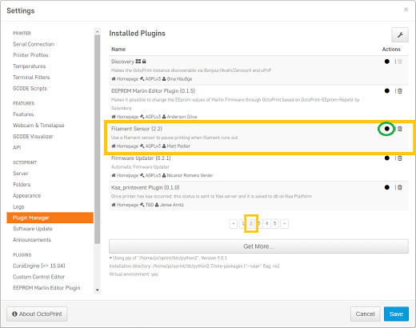

Once you have de-selected this plugin, you will need to restart Octoprint. A pop up will show on the top right of the interface - click 'restart now'. Your plugin will now be disabled and ready for printing.

.. image:: images/restart-now.PNG
   :alt: Octoprint Restart Now
   :align: center

**How to connect the printer to the wireless network through hotspot mode**

If you are having trouble connecting to a wireless network directly through the Robo C2 or Robo R2 screen, you can use the web dashboard to get around this issue.

1. First, we must connect to the printer via hotspot mode. Once we have secured a connection through hotspot mode, click on your 'Settings' button in the upper right of the interface.

2. Next, scroll down to 'Network connection' at the bottom of the left hand menu. Here you will see a list of available wireless networks that you can connect to.

3. Choose a wireless network that you wish to connect to, and press 'Connect'.

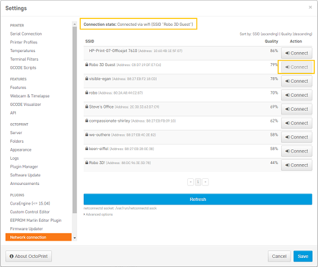

4. A pop up will come up to enter a password. Enter it and press 'confirm'. If you connected correctly, the 'connection state' will show you if you are connected to the wireless network of your choice.

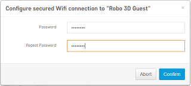

View history and statistics of printer
---------------

There are a few modules on the web dashboard that allow you to view some statistics of your printer. Some of the things you can get info on are; history, prints per day and success rate, printer statistics, and power usage. This is a good way to track your printer and will be displayed as the following;

.. image:: images/statistics.png
   :alt: Statistics
   :align: center

Set your z-offset
---------------

With the web dashboard, you can manually adjust your z-offset value. To do this, click the 'Settings' button in the upper right of the interface. When the settings window pops up, scroll to the bottom of the menu on the left hand side. Here you will find a menu option named 'EEPROM Marlin Editor Plugin' that you will need to select. This will bring up an almost empty page. There are two buttons labeled 'Load EEprom' and 'Save to EEprom'. Go ahead and click the 'Load EEprom' button.

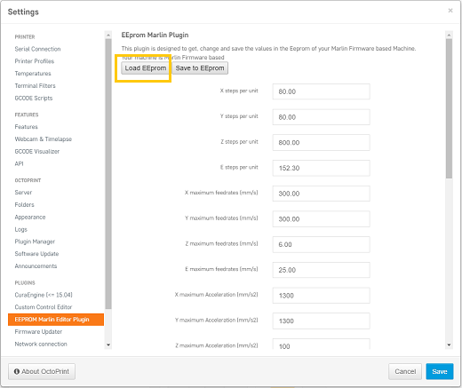

This will load the values of some of the core settings that your printer runs on. From here, scroll down and find the 'z-offset' value. Here, you can manually adjust this value (note: a higher negative number will increase your z-offset, meaning the bed will be farther away from the nozzle).

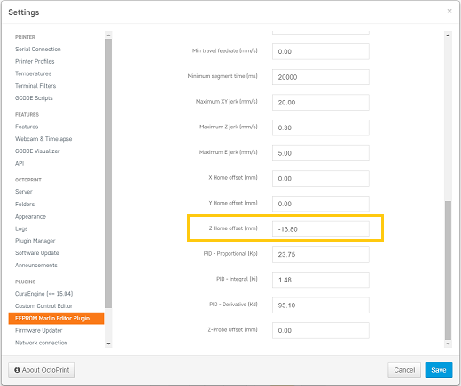

From here, you will need to scroll back to the top of the page and select 'Save to EEprom' to correctly save the value to your printer. Once that is saved, you can then click save on the bottom right of your window. Remember: if you don't click the 'Save to EEprom' button, your new z-offset will NOT be saved and will use the old value entered previously.

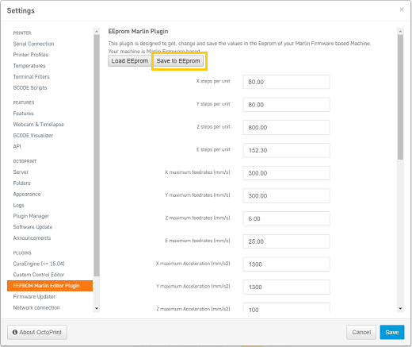

Monitor your print
---------------

From the web dashboard, you are able to monitor your print, as well as start, pause, and cancel a print. In the top left of the interface under 'state', you will find information such as: the file selected, total print time, elapsed print time, print time left, as well as the option to print, pause, and cancel your current file.

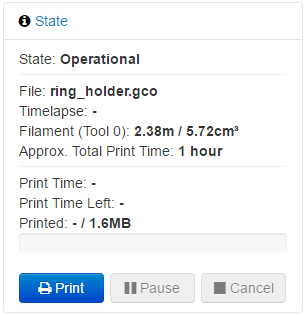

Download OctoPrint Logs for Support
-----------------
The OctoPrint Logs will enable our support team to better diagnose your problem and help get your Robo up and printing ASAP!

Once on the Robo Dashboard, navigate to Settings at the Top right of the Screen.

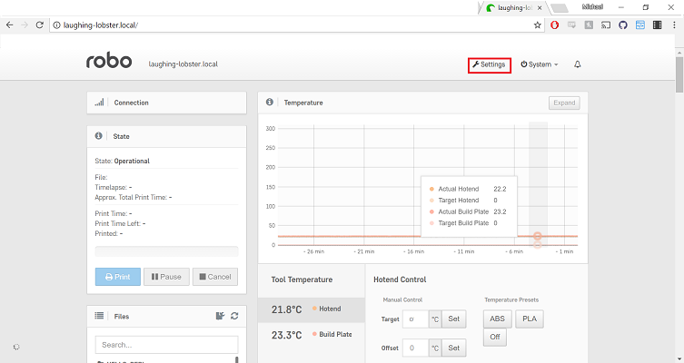

Here scroll down the Side Bar and Locate the Logs tab.

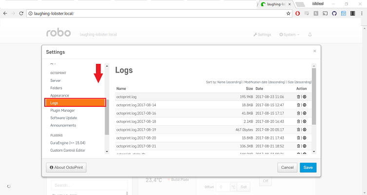

Lastly, make sure the files are sorted by most recent. To do that Click "Modification Date (Descending)" and double check the files are arranged by date starting with the most recent. Then download the top three files, 'octoprint.log', 'plugin_printhistory_console.log', and 'octoprint_stats.db'.

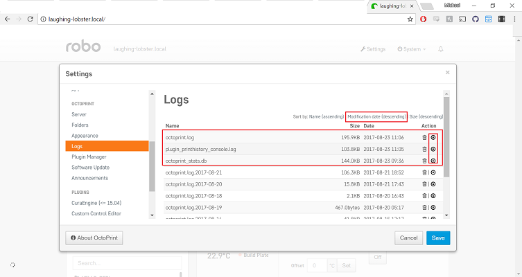
